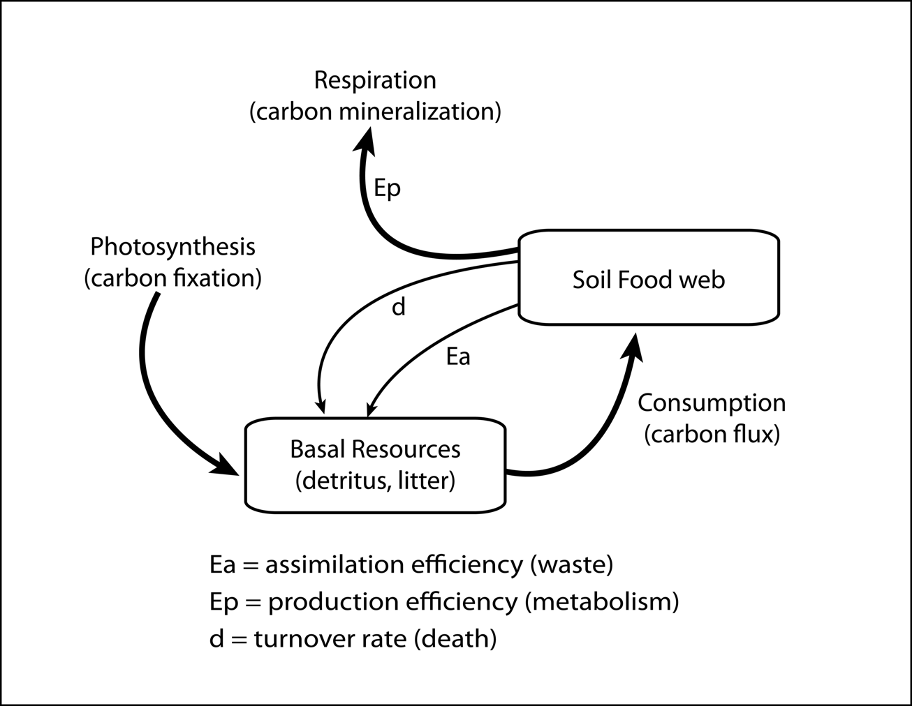
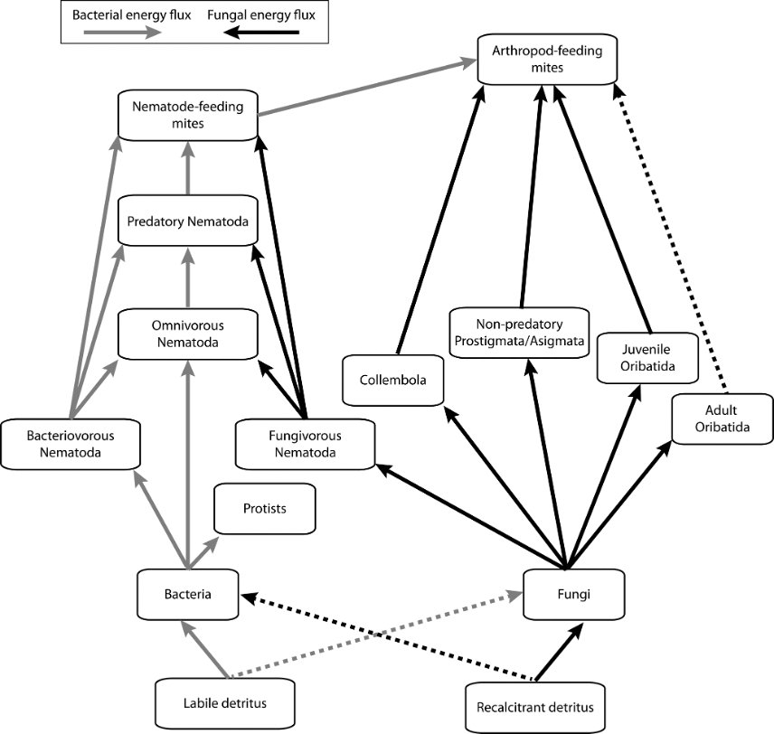

# About this Project

```{r Libraries, message=F, warning=F}
library(ggplot2)
library(ggtext) # expression()
library(dplyr)
library(forcats) # fct_recode
library(tidyr)
library(ggpubr) # ggqqplot()
library(rstatix) # shapiro_test()
library(car) # Anova()
library(vegan)
library(soilfoodwebs)
library(tibble) # rownames_to_column

RNGkind(sample.kind = "Rounding") 
```
<br>

# Abstract
Short-term climate perturbations affect both predator and prey species that comprise soil communities, and alter carbon flux. I used a mesocosm experiment to model the effects of experimentally-imposed temperature and moisture conditions that simulate potential future conditions during climate perturbations, on peatland soil food web flux and soil carbon sequestration after three-weeks of experimentally imposed conditions, and then again after an additional three-week recovery under control conditions. I compared system resistance and resilience, and modelled carbon (C) and nitrogen (N) fluxes throughout the mesocosm experiment. There was a lack of resistance of the soil food web to perturbation shown by changes in total faunal abundance under imposed soil moisture treatments. System resistance and resilience are important concepts to understand as climate change threatens C storage in boreal peatlands, a globally significant C store.
<br>

# Keywords
carbon flux, nitrogen mineralization, soil biodiversity, boreal peatlands, energetic food web models, hydrological changes, warming
<br>

# Summary for Lay Audience
Carbon (C) makes up the substrate, habitat, and diet of soil-dwelling organisms. Therefore, soil food web C storage is defined by the total amount of C consumed by soil fauna less the total C released to the atmosphere by the respiration of soil fauna. Short-term changes in temperature and soil moisture affect the storage of C in soils. Boreal peatlands are a wetlands ecosystem found across Canada that play an especially important role in global C storage. The goal of my thesis was to determine the effects of potential future temperature and soil moisture conditions on the total number of soil fauna, the total amount of C consumed by soil fauna, and the total C released to the atmosphere by the respiration of soil fauna before the simulated short-term event, immediately following the event, and then following a subsequent recovery period under control conditions in peat-soils collected from White River, Ontario. Overall, the total number of soil fauna tended to decrease following the simulated event, and this was driven by imposed soil moisture treatments. The total number of fauna did not increase following the recovery period, and this was most noticeable in the number of fungal-feeding soil fauna. System resistance and resilience are important concepts to understand as climate change threatens C storage in boreal peatlands, a globally significant C store.
<br>

# Co-Authorship Statement
In the following thesis, the soil fauna abundance, biomass, and food web modelling following three-week perturbation (i.e., T1 data) was published in a Special Issue on soil food web (Pettit et al. 2023):
 
::: {.refbox}
>Pettit, T., Faulkner, K.J., Buchkowski, R.W., Kamath, D., and Lindo, Z. (2023) *Changes in peatland soil fauna biomass alter food web structure and function under warming and hydrological changes. European Journal of Soil Biology* 117: 103509. <https://doi.org/10.1016/j.ejsobi.2023.103509>
:::
  
TP, KJF and ZL conceived the experiment; TP and KJF performed the field sampling and experiment; TP identified and enumerated the mesofauna samples; DK enumerated the microfauna subsamples; TP generated the biomass data, and performed the food web analysis; RWB wrote the code for the food web model; TP wrote the draft of the manuscript with input from ZL; all authors contributed to the final version of the article.
<br>

# Acknowledgments 
I thank Dr. Zoë Lindo for the support and help through both my undergraduate and graduate research projects. Thank you for always keeping me on track over our many weekly one-on-ones, both virtually and otherwise. Also, thanks to Dr. Brian Branfireun for allowing me to use the facilities in his lab for my research and guidance in the field.  
  
I also thank my advisors, Dr. Keith Hobson and Dr. Yolanda Morbey. Your feedback and flexibility are greatly appreciated! I especially thank Dr. Morbey for advising both my undergraduate and graduate research projects.  
  
Thanks to all my Lindo Lab mates past and present for the tremendous help and numerous teardowns. I especially thank Dr. Katy Faulkner for help from the start through the end of the project and for always being available for questions. I also give special thanks to Dr. Rob Buchkowski for years’ worth of help troubleshooting and for helping me develop my interest in modelling.  
  
Finally, I thank my family and Sydney for their constant support.
<br>

# Chapter 1: Introduction
## 1.1 Carbon Cycling in the Soil Food Web
Nearly 80% of all carbon (C) stored in terrestrial ecosystems (2500 GT of C) is found in soils ([Batjes, 1996](https://doi.org/10.1111/j.1365-2389.1996.tb01386.x)). Net primary production derived from aboveground photosynthesis drives the input of fixed C into soil systems as detritus (i.e., dead organic matter) which serves as the basal energy source for soil food webs ([de Vries and Caruso, 2016](https://doi.org/10.1016/J.SOILBIO.2016.06.023)). Carbon is then transferred from one trophic level (or trophic group) to another via consumption during trophic interactions in an overall process that contributes to decomposition of detritus. At the same time, C transformations occur belowground as C is stored as living biomass, recycled to the detritus pool through feces and other consumptive waste, and as natural (non-consumptive) death of soil organisms. Carbon is lost from soils as carbon dioxide (CO~2~) as a function of metabolic respiration by members of the soil food web ([Moore and de Ruiter, 2012](https://books.google.com/books/about/Energetic_Food_Webs.html?id=srX39_-9E0wC)). Thus, the fate of soil C is a function of detrital inputs, the soil food web, and related heterotrophic respiration outputs ([Figure 1.1]).  
  
### Figure 1.1 Conceptualized flow of carbon and nutrients through soil systems.
```{r Fig1-1, echo=FALSE, fig.cap="Carbon initially enters the soil system as detritus which is derived from aboveground photosynthesis and net primary productivity (I.e., carbon fixation). Detritus (dead organic inputs largely from aboveground sources) forms the basal resource for the soil food web. Detrital carbon and nutrients is transferred among members of the food web through consumption. Consumption drives fluxes of carbon within and between nodes in the soil food web. Carbon returns to the detrital pool through waste due to inefficient trophic assimilation (E~a~) and through non-consumptive death (d) of soil organisms. Carbon is lost from the soil system through carbon mineralization, by which organic carbon is turned into inorganic (i.e., mineral) forms. In soils, carbon mineralization is largely heterotrophic respiration associated with metabolism of soil organisms (i.e., production efficiency, E~p~). Soil carbon pools are both the detrital pool and the soil organisms themselves that comprise the soil food web.", out.width = '100%'}

```
<br>

The soil food web consists of several trophic levels and many taxonomic groups. The primary consumers (decomposers) of detritus are the microbial groups (fungi, bacteria, protists) that use C and other nutrients from detritus as well as root exudates to maintain biomass and metabolic function. Feeding on the microbes (secondary consumers/decomposers) are a wide variety of taxa that include microfauna (e.g., nematodes) and mesofauna (e.g., mites and collembola), while predators of the system are mainly other nematode and mite groups. Carbon is the main energetic currency for heterotrophic organisms, alongside nutrients (e.g., nitrogen (N)), that is transferred among members of the soil food web. However, the process of trophic transfer especially of C is inefficient ([Hunt et al., 1989](https://doi.org/10.1007/BF02202593)), as C is lost from the food web due to metabolic and other biological processes. Specifically, consumed C (and other nutrients) must first be assimilated (digested) so that energy is available for cellular processes including general metabolic maintenance as well as growth and reproduction. Assimilation efficiency (E~a~) differs greatly among soil organisms (e.g., collembola E~a~ = 50% vs. nematode-feeding mites E~a~ = 90% ([Moore and de Ruiter, 2012](https://books.google.com/books/about/Energetic_Food_Webs.html?id=srX39_-9E0wC))), with unassimilated food released as waste products that return to the detrital source pool. Assimilated C is then allocated to metabolic function or production (i.e., growth and reproduction). Following the Metabolic Theory of Ecology, metabolic functions for soil organisms are largely controlled by temperature ([Brown et al., 2004](https://doi.org/10.1890/03-9000)), and C is lost as a by-product of metabolism as CO~2~ via heterotrophic respiration. Production efficiency (E~p~), which then defines the C allocated to growth and reproduction with metabolic waste released as respired CO~2~, is a function of metabolic activity and also varies across different soil organisms (e.g., fungi E~p~ = 30% vs. protists E~p~ = 40% ([Moore and de Ruiter, 2012](https://books.google.com/books/about/Energetic_Food_Webs.html?id=srX39_-9E0wC))). Metabolism increases and thus production efficiency decreases with increasing temperature. Thus, changes in both the soil food web topology and metabolism (temperature) drive changes in soil C storage ([Figure 1.1]).
<br>

## 1.2 The Stability of Soil Food Webs
The stability of a system can be considered as two components ([Allison and Martiny, 2008](https://doi.org/10.1073/pnas.0801925105)): resistance and resilience. Whether a system resists change under such a perturbation (resistance) and/or how fast a system recovers from a perturbation (resilience) when it does change are important parameters to understand how biodiversity may be altered under climate and other anthropogenic change. The extent to which a community biomass decreases immediately following a disturbance is indicative of the level of resistance ([Hillebrand and Kunze, 2020](https://doi.org/10.1111/ele.13457)); the faster recovery of community biomass following a disturbance is indicative of resilient communities ([Griffiths and Philippot, 2013](https://doi.org/10.1111/j.1574-6976.2012.00343.x)). The resistance of a community to a disturbance plays an important role in determining how long it will take a community to recover ([Hillebrand and Kunze, 2020](https://doi.org/10.1111/ele.13457)). The resistance and resilience of communities depends on several factors, including resource availability ([Gessler et al., 2017](https://doi.org/10.1111/nph.14340)), biodiversity ([Isbell et al., 2015](https://doi.org/10.1038/nature15374)), and species traits ([Gladstone-Gallagher et al. 2019](https://doi.org/10.1016/j.tree.2019.07.010)). However, examples of stability, resistance and resilience are uncommon for whole soil food webs (but see [de Vries et al., 2012](https://doi.org/10.1038/nclimate1368)).  
  
There are several factors that suggest soil systems should show high levels of stability. First, soil food webs are complex systems characterized by many trophic groups ([Digel et al., 2014](https://doi.org/10.1111/oik.00865)) and high species richness within trophic groups ([Verhoef and Brussaard, 1990](https://doi.org/10.1007/BF00004496)). Soil food webs are also characterized by many complex interactions, including omnivory ([Neutel et al., 2002](https://doi.org/10.1126/science.1068326)), cannibalism ([Moore and de Ruiter, 2012](https://books.google.com/books/about/Energetic_Food_Webs.html?id=srX39_-9E0wC); [Buchkowski et al., 2022](https://doi.org/10.1016/J.SOILBIO.2022.108773)), necrophagy ([Luxton, 1972](https://eurekamag.com/research/000/208/000208036.php)), and intraguild predation ([Parimuchová et al., 2021](https://doi.org/10.1038/s41598-021-84521-1)). Complex interactions tend to be weaker than other consumer-resource interactions (i.e., direct predator – prey trophic transfer), which has been suggested to have greater stability than systems with fewer complex interactions ([O’Gorman and Emmerson, 2009](https://doi.org/10.1073/pnas.0903682106); [LeCraw et al., 2014](https://doi.org/10.1007/s00442-014-3083-7)).
  
Soil food webs also tend to show a ‘diamond’ shaped trophic topology ([McCann and Rooney, 2009](https://doi.org/10.1098/rstb.2008.0273)) with two compartmentalized subwebs stemming from a basal resource and fed upon by a common top predator. This results in the soil food web having two discrete resource compartments or energy channels that form from lower-order consumers (bacteria or fungi) that tend to derive the bulk of their C from different aspects of the detrital pool ([Rooney et al., 2006](https://doi.org/10.1038/nature04887)). These two energy channels support different microbial consumers, and the channels differ in production and turnover rate. The bacterial energy channel exhibits faster turnover than the fungal channel as indicated by greater production:biomass ratios in soil systems dominated by non-woody plants ([Rooney et al., 2006](https://doi.org/10.1038/nature04887)) and when detrital inputs have low C:N ratios. The fungal energy has a slower turnover rate and is dominant when detrital inputs have high C:N ratios. Top arthropod predators such as predatory mites couple these distinct energy channels as their prey are consumers in both the bacterial and fungal energy channels. Asynchrony in rates of population turnover among members of the two different energy channels translates into a more stable prey base for the top predators, and thus acts as an important stabilizing mechanism ([McCann, 2000](https://doi.org/10.1038/35012234); [Teng and McCann, 2004](https://doi.org/10.1086/421723)) for the soil fauna food web. Thus, soil food webs are considered to be biodiverse, complex, and stable systems ([de Castro et al., 2021](https://doi.org/10.1002/ece3.8278)).
  
The stability (i.e., the resistance to perturbation) of soil fauna food webs has implications for global processes like climate change that include both long-term changes in temperature and precipitation, as well as greater variability in temperature and precipitation extremes. But the stability of soil fauna communities can be impacted by anthropogenic changes such as both changes in habitat geometry (i.e., the amount, shape, and connectivity of habitat) and disturbance regime (i.e., the spatial and temporal patterns of perturbation). For example, a study of moss-living microarthropods found that species richness and abundance declined corresponding to increased disturbance rate, but that the speed of this decline depended on the connectivity of the surrounding habitat ([Starzomski and Srivastava, 2007](https://doi.org/10.1111/j.0030-1299.2007.15547.x)). In another study, [Shackelford et al. (2018)](https://doi.org/10.1186/s13750-018-0142-2) found that microarthropod communities connected to undisturbed landscapes showed a  linear and rapid recovery following a disturbance, whereas those connected to disturbed landscapes showed a hump-shaped recovery and isolated communities showed a slow but linear recovery. However, abiotic factors other than habitat connectivity that may buffer soil fauna communities from disturbances are less well studied.
  
Stability (resistance, resilience) in soil food webs also depends on food web topology and the dominant microbial energy channel involved. [de Vries et al. (2012)](https://doi.org/10.1038/nclimate1368) found that temperate grassland soil food webs that were dominated by fungi were more resistant, although not resilient, to drought conditions than bacteria-dominated agricultural soil food webs from wheat fields located on the same slope and from the same soil type. Fungal-dominated grassland soil food webs were also found to incorporate C more efficiently, corresponding to lower amounts of C lost through microbial respiration, and fungal-based food webs supported increased diversity and richness of microarthropods. The greater resistance of fungal-dominated soil food webs to perturbation may have been caused by increased resource availability in the form of increased dissolved organic C and fungal biomass, consistent with findings in previous grasslands studies ([Cole et al., 2006](https://doi.org/10.1016/J.APSOIL.2005.11.003)). In turn, increased microarthropod diversity was associated with increased N leaching from grassland soils ([de Vries et al., 2012](https://doi.org/10.1038/nclimate1368)), consistent with previous findings that microarthropod richness can stimulate N mineralization ([Liiri et al., 2002](https://doi.org/10.1034/j.1600-0706.2002.960115.x)). Overall, these findings suggest that fungal-based soil food webs support a greater evenness of microbial communities and a greater diversity of microarthropods, which in turn helps improve the resistance of soil fauna food webs to the effects of other abiotic factors, like drought ([de Vries et al., 2012](https://doi.org/10.1038/nclimate1368)).
  
However, the duration and timing of a perturbation can also affect stability outcomes in soil systems. For instance, [Thakur et al. (2021)](https://doi.org/10.1111/1365-2435.13696) demonstrated that a one-week, ‘pulse’ extreme heat event significantly affected mesocosm soil microbial communities constructed from northern European soils and that differences in microbial community structure between heat shock and ambient treatments were maintained for the duration of the study suggesting low ecosystem resistance and resilience. These findings highlighted the importance of species traits following a disturbance, as the short-term heat event was more detrimental to microbes than microbial predators. Mechanistically, it was suggested that thermal acclimation (e.g., changes in body size or physiological activity) to heat stress promoted predator resilience, but not microbial resilience.
  
Yet, it is still unknown how soil fauna food webs will respond to short term disturbances that are expected to become more frequent as a function of climate change ([IPCC, 2018](https://www.ipcc.ch/sr15/)). How a soil food web responds to a perturbation with respect to changes in the biomass or metabolism of individual members of the soil food web may subsequently lead to changes in ecosystem-level processes like soil respiration rates ([Thompson et al., 2018](https://doi.org/10.1098/rspb.2018.0038)) ultimately affecting soil C storage potential. However, it is still unknown what effect short-term climate events related to temperature might have on soil fauna food web structure and function, or what role other (potentially mitigating) environmental factors like soil moisture might play. Because C and N cycling are emergent ecosystem properties, resistant and resilient soil communities may better maintain energy and nutrient cycling following a perturbation. This is especially true for disturbance events such as extreme, short-term warming that can alter the metabolic demands of organisms.
<br>

## 1.3 Boreal Peatlands
Boreal peatlands, found across much of northern Canada, are wetlands characterized by low aboveground vascular plant productivity and a thick (in excess of 40 cm deep) layer of peat, or decomposing organic material ([Beaulne et al., 2021](https://doi.org/10.1038/s41598-021-82004-x)) arising from slow decomposition. Peatlands are repositories for belowground biodiversity ([IUCN, 2021](https://iucn.org/resources/annual-reports/iucn-2021-international-union-conservation-nature-annual-report)) and are the Earth’s largest terrestrial store of soil C ([Limpens et al., 2008](https://doi.org/10.5194/bg-5-1475-2008)). Peatlands store C as soil because inputs from aboveground plant productivity exceed the rate at which C is lost from the system through decomposition as heterotrophic respiration ([Gorham, 1991](https://doi.org/10.2307/1941811)). This occurs despite low levels of productivity because rates of decomposition and C cycling through the soil food web are even lower. Low rates of decomposition and heterotrophic respiration occur because of ecostoichiometric limitations like N limitation, resulting from plant inputs that are generally nutrient poor ([Bragazza et al., 2006](https://doi.org/10.1073/pnas.0606629104)). Nutrient limitations and waterlogged (anoxic) conditions limit the biomasses of soil fauna, which function as secondary decomposers ([Xu et al., 2022](https://doi.org/10.1016/j.foreco.2021.119738)). Biological activity (e.g., metabolic processes) also occurs at a slow rate because of low soil temperatures ([Carrera et al., 2009](https://doi.org/10.1111/j.1365-2435.2009.01560.x)) and high soil moisture ([Bian et al., 2022](https://doi.org/10.3389/fevo.2022.857185)). Peatland fauna biomasses are often lower than that of forests ([IPCC, 2000](https://www.ipcc.ch/report/emissions-scenarios/)) or other non-wetland systems, however these systems store a large amount of C because productivity exceeds rates of heterotrophic respiration.
  
Boreal peatlands are dominated by plants like mosses, sedges, and shrubs ([Gore, 1984](https://doi.org/10.1002/iroh.19840690318)). In these systems, peat is thereby primarily composed of litter from these plants in varying stages of decomposition. Peat acts to form a pool of biologically available forms of nutrients, like N and phosphorus, to support a complex and species diverse soil food web. At the same time, this peat serves as habitat for complex microbial communities (Asemaninejad et al., [2017](https://doi.org/10.1016/J.FUNECO.2017.02.002), [2019](https://doi.org/10.1080/11956860.2019.1595932)), nematodes ([Kamath et al., 2022](https://doi.org/10.1016/j.pedobi.2022.150809)), and microarthropods ([Barreto and Lindo, 2018](https://doi.org/10.1080/11956860.2017.1412282)). Aboveground plant communities are linked to the structure of microbial and faunal communities. For example, microbial communities in moss-dominated systems are characterized by greater ratios of fungi:bacteria, when compared to those in sedge-dominated systems, corresponding to greater plant diversity and lower quality (i.e., high C:N ratio) litter inputs that form peat ([Lyons and Lindo, 2020](https://doi.org/10.1007/s11258-020-01037-w)). Correspondingly, the dominant nematode trophic group is related to the dominant microbial group within a system (i.e., fungal-dominated systems contain greater abundance and biomass of fungal-feeding nematodes), and similarly nematode trophic diversity is higher in fungal-dominated peatland food webs than bacterial-dominated food webs ([Kamath et al., 2022](https://doi.org/10.1016/j.pedobi.2022.150809)). Furthermore, nematode communities in nutrient poor, fungal-dominated peatland food webs are more complex than their bacterial-dominated, intermediate nutrient counterparts, due to an increase in the abundance and size of nematode predators ([Kamath et al., 2022](https://doi.org/10.1016/j.pedobi.2022.150809)). While plant litter quality affects the structure of peatland soil food web fungal and bacterial energy channels and is an important driver of decomposition dynamics, abiotic environmental conditions (e.g., temperature, soil moisture) are the main drivers of the structure of microarthropod communities. Specifically, the richness and abundance of microarthropods in boreal peatland hollow microhabitats, characterized by wet depressions, is greater than that observed in hummock microhabitats, characterized by dry and raised areas ([Barreto and Lindo, 2018](https://doi.org/10.1080/11956860.2017.1412282)), but at the same time, peatlands with high levels of peat moisture have lower species richness ([Barreto and Lindo, 2021](https://doi.org/10.11158/saa.26.5.4)). Strong above- and below-ground linkages help reinforce the complexity and stability of peatland soil food webs.
<br>

## 1.4 Effects of Climate Change on Boreal Peatland Soil Food Webs
Climate change involves several environmental changes including increases in ambient temperature, increased variability in temperature, and changes in precipitation that can include increases, decreases, and increased fluctuations between wet and dry conditions. Global average anthropogenic warming reached +1.25 &deg;C in 2022 ([Haustein et al., 2017](https://doi.org/10.1038/s41598-017-14828-5); [Matthews and Wynes, 2022](https://doi.org/10.1126/science.abo3378)), and the rate of anthropogenic warming is increasing at an estimated 0.2 &deg;C per decade ([IPCC, 2018](https://www.ipcc.ch/sr15/)). Changes in temperature are predicted to be more extreme at high latitudes, with short-term extreme warming events (i.e., > 8 &deg;C above average) becoming more common ([IPCC, 2018](https://www.ipcc.ch/sr15/)). Global precipitation patterns are also anticipated to be highly variable under future climate conditions with many areas experiencing greater than normal wetting or drying of soils ([Zhang et al., 2022](https://doi.org/10.1038/s41467-022-32711-4)). In combination with changes in global temperature regimes, changes in precipitation are expected to drive divergent shifts in the hydrology of boreal peatlands. [Zhang et al. (2022)](https://doi.org/10.1038/s41467-022-32711-4) found that the 54% of high-latitude peatlands had become dryer over the past 200-years; yet many (32%) high-latitude peatlands had become wetter over this same time period, while several (14%) showed fluctuating hydrological conditions. However, warmer temperatures may indirectly reduce soil moisture content ([Holmstrup et al., 2017](https://doi.org/10.1038/srep41388)) through increased evapotranspiration ([Seneviratne et al., 2010](https://doi.org/10.1016/J.EARSCIREV.2010.02.004)). It is still unknown whether greater soil moisture may help buffer the effects of temperature through evaporative cooling in the soil microenvironment, or what the combined effects of short-term changes in temperature and soil moisture are on soil food webs and C dynamics. 
  
Both warming and increased peat saturation are anticipated to affect the peatland soil food web and its C transformations. Mechanistically, warming is anticipated to alter decomposer biomass through increasing organismal metabolism that can lead to faster population turnover rates with increased fecundity and death rates ([Kuriki, 2008](https://doi.org/10.2300/acari.17.75); [Li et al., 2019](https://doi.org/10.1111/gcb.14517); [Pfingstl and Schatz, 2021](https://doi.org/10.11646/zoosymposia.20.1.4)). Warming also decreases metabolic assimilation and production efficiencies (Luxton, [1972](https://eurekamag.com/research/000/208/000208036.php), [1981](https://doi.org/10.1016/S0031-4056(23)03677-6); [Li et al., 2019](https://doi.org/10.1111/gcb.14517)), potentially reducing population biomasses and therefore reduce trophic transfer of energy and nutrients from one trophic level to the next. Correspondingly, experimental warming has been shown to decrease ([Bokhorst et al., 2008](https://doi.org/10.1111/j.1365-2486.2008.01689.x)) or increase ([Lindo, 2015](https://doi.org/10.1016/j.soilbio.2015.09.003)) soil fauna abundances. For instance, [Lindo (2015)](https://doi.org/10.1016/j.soilbio.2015.09.003) found increased abundance in smaller bodied invertebrates under warming, while [Barreto et al. (2021)](https://doi.org/10.11158/saa.26.5.4) found contrasting effects on species richness depending on initial soil moisture conditions of the site. [Meehan et al. (2021)](https://doi.org/10.1016/j.pedobi.2021.150742) found warming increased abundances in soil predators in boreal forests, but whether the soil community was affected by warming was dependent on other (potentially mitigating) environmental conditions ([Meehan et al., 2020](https://doi.org/10.1016/j.pedobi.2020.150672)). However, it is still unknown what effect short-term extreme climate warming events might have on resistance and resilience of the whole soil food web and C flux, or what role soil moisture might play.
  
Soil fauna typically show a skewed but unimodal response to soil moisture ([Sylvain et al., 2014](https://doi.org/10.1111/gcb.12522)) where increases in soil moisture are often correlated with increased abundance and species richness of soil microarthropods, except at high levels of soil moisture where reductions in the habitable pore space of soil can reduce soil fauna biomass ([Tsiafouli et al., 2005](https://doi.org/10.1016/J.APSOIL.2004.10.002); [Turnbull and Lindo, 2015](https://doi.org/10.1016/J.SOILBIO.2014.12.007)). Alterations in soil moisture can be particularly detrimental for soil organisms in poorly drained, naturally wet soils such as peatlands. For instance, [Barreto et al. (2021)](https://doi.org/10.11158/saa.26.5.4) found that warming-induced drying of peat soil enhanced faunal species richness where the colonization of more xeric species was possible, but at the expense of peatland-specific semi-aquatic species. The effect of increasing soil moisture on peatland fauna is less well known. Flooded conditions are predicted to become more common with global warming in the 21st century and are predicted to limit soil oxygen availability, thus reducing soil nutrient availability, mineralization, and decomposition of organic material ([Schuur and Matson, 2001](https://doi.org/10.1007/s004420100671)). Consequently, anaerobic conditions quickly develop in flooded soils ([Visser and Voesenek, 2005](https://doi.org/10.1007/s11104-004-1650-0)), which can further cause changes in physical and chemical soil properties ([Unger et al., 2010](https://doi.org/10.1016/J.ENVEXPBOT.2010.03.005)) including the accumulation of phytotoxic products as a function of microbial reduction processes in anoxic conditions ([Schuur and Matson, 2001](https://doi.org/10.1007/s004420100671)). These changes in soil properties are predicted to affect the composition of soil food webs ([González-Macé and Scheu, 2018](https://doi.org/10.1371/journal.pone.0202862)). However, it is unclear whether the combination of changes in temperature regimes and hydrology expected in peatlands will have an interactive effect on soil food webs, or what effects these changes will have on C and N cycling.
  
Combined, future warming and changes in soil moisture are thought to threaten the ability of boreal peatlands to sequester C, and may shift boreal peatlands from being a C sink to a C source ([Bragazza et al., 2013](https://doi.org/10.1038/nclimate1781); [Crowther et al., 2016](https://doi.org/10.1038/nature20150); [Harenda et al., 2018](https://doi.org/10.1007/978-3-319-71788-3_12)). Warming-induced changes in aboveground vegetation ([Weltzin et al., 2000](https://doi.org/10.1890/0012-9658(2000)081[3464:ROBAFP]2.0.CO;2); [Dieleman et al., 2015](https://doi.org/10.1111/gcb.12643); [Lyons and Lindo, 2020](https://doi.org/10.1007/s11258-020-01037-w)) and the soil food web ([Gilman et al., 2010](https://doi.org/10.1016/j.tree.2010.03.002); [Schwarz et al., 2017](https://doi.org/10.1038/s41558-017-0002-z)) drive an increase in total consumptive flux under warming. At the same time, heterotrophic respiration is expected to increase under warming ([Brown et al., 2004](https://doi.org/10.1890/03-9000)). Thus, changes in C storage potential for peatland soil food webs can be examined by calculating the total C flux in the soil food web minus the C lost to the atmosphere as heterotrophic CO~2~ respiration. Whether increased soil moisture can buffer the effects of warming on the soil food web and C and N cycling is unknown.
<br>

## 1.5 Research Objectives
My research investigated how a pulse climate warming event affects the peatland soil fauna food web and corresponding C cycling. My overall objective was to determine how extreme heat and changes in hydrology affect the resistance and resilience of a peatland soil food web and its C functions. Specific objectives included:
  
::: {.refbox}
>1. Comparing the abundances of the microfauna (nematodes) and mesofauna (microarthropods), and microbial activity (enzyme activity) under short-term (i.e. 21-days), extreme climate perturbations of temperature and soil moisture relative to a field-based control conditions using peat mesocosms and a full-factorial design (Resistance).
>2. Examining whether any measurable response of perturbed mesocosms is mitigated when mesocosms are returned to field-based temperatures (Resilience).
>3. Modeling the C and N flux and mineralization through the soil fauna food web immediately following short-term, extreme climate perturbations of temperature and soil moisture and following a recovery period using an energetic food web model.
:::
  
I hypothesized that warming will accelerate reproductive rates, especially in small-bodied organisms. Thus, I predicted that soil fauna abundances would increase under warming. At the same time, I hypothesized that greater soil moisture would reduce total soil fauna abundances, corresponding to a reduction in total habitable pore spaces in saturated soils. Correspondingly, I predicted that average total biomass will be greatest in mesocosms assigned to +8 &deg;C warming and field-moist conditions and will be least in those assigned to ambient temperature and saturated conditions. I also hypothesized that soil moisture will enhance system resistance and resilience to heat shock due to the specific heat capacity of water. Thus, I predicted that biomasses in mesocosms assigned to +8 &deg;C warming and saturated conditions will be more resistant and resilient than those assigned to +8 &deg;C warming and field-moist conditions. Furthermore, I predicted that biomasses in mesocosms assigned to +8 &deg;C warming and saturated conditions would be more similar between sampling times immediately following (T~1~) the climate perturbation and after a recover period (T~2~) than those assigned to +8 &deg;C warming and field-moist conditions.
  
In the energetic model of the system, I predicted that the total C flux and C mineralization through the soil fauna food web will be directly correlated with soil fauna population biomasses and temperature-mediated metabolism. Thus, I predicted that C flux and C mineralization will be greatest under +8 &deg;C warming and field-moist conditions and least under ambient temperature and saturated conditions while exposed to the temperature/moisture perturbation. At the same time, I predict that when temperature-mediated metabolic demands are removed, differences between temperature treatments will be more similar, but biomass shifts resulting from alterations in soil moisture will persist as these conditions will take longer to recover from.
  
I used a paired empirical and model approach to capture changes in both the soil community and larger ecosystem functioning under warming and hydrological changes. Comparing empirical changes in abundance and biomass allowed me to examine population level responses in the soil food web at the level of individual nodes, but this approach alone is limited in generalizability as it does not capture emergent soil properties that operate at the scale of whole ecosystems and landscapes. Integrating both empirical and model approaches will allow me to better understand how changes in ecosystem level functions like soil C and N transformations emerge from changes at the level of individual nodes in the soil fauna food web.
<br>

# Chapter 2: Methods and Experimental Design
## 2.1 Soil Sampling
Peatland soils were collected in September 2021 from a *Sphagnum*-dominated peatland that is part of the BRACE (Biological Response to A Changing Environment) experimental peatland project in the southern boreal mixed-wood forest ecozone. This site is located near White River,
Ontario, Canada ([48°21′ N, 84°20′ W](https://maps.app.goo.gl/r9KosViMRUCykji5A)), and is a long-term research monitoring site used by the Ontario Ministry of Natural Resources and Forestry for the past 20 years. The peatland is a nutrient-poor fen, with a pH ~4.1 and a water table ~30 cm deep that fluctuates seasonally. Previous studies at this site have characterized vegetation ([Lyons and Lindo, 2020](https://doi.org/10.1007/s11258-020-01037-w)), bacterial and fungal communities (Asemaninejad et al., [2017](https://doi.org/10.1016/J.FUNECO.2017.02.002), [2019](https://doi.org/10.1080/11956860.2019.1595932))), nematodes ([Kamath et al., 2022](https://doi.org/10.1016/j.pedobi.2022.150809)), and soil microarthropods ([Barreto et al., 2021](https://doi.org/10.11158/saa.26.5.4)).
  
Intact peat core samples (8 x 8 cm x 15 cm deep) were cut and removed using a small, hand peat saw from randomly selected ‘lawn’ areas (i.e., avoiding hummocks and hollows) that were dominated by *Sphagnum* spp. to exclude vascular plants as much as possible. To account for any heterogeneity in the sampling location, samples were collected in blocks that represented nearby locations of lawn areas, but all samples were collected within a roughly 25 m x 25 m area. Some sample locations were characterized by high microfauna and high mesofauna abundance and were subsequently dealt with in the statistical analyses using block effects (i.e., two blocks, high and low abundance). Intact peat cores were placed in individual plastic bags, kept cool in the field, and refrigerated (4 &deg;C) until the start of the experiment within 48 hours of sample collection. A total of 45 peat core samples were collected.
  
In the lab, each intact peat core was placed into a 500 mL glass jar to create experimental mesocosms that were placed into incubation at 12 &deg;C under field moist conditions for two weeks to allow each mesocosm to recover from the disturbance. Both the weight of the soil core and the final weight of the mesocosm (soil plus jar) was recorded to monitor moisture loss and replace moisture loss as necessary during the experiment. Following this recovery period, five mesocosms were selected to be destructively sampled (T~0~). The remaining 40 mesocosms were randomized into experimental treatments of temperature (12 &deg;C and 20 &deg;C) and moisture level regime (field-moist and saturated soil moisture) with ten replicates of each factorial treatment (12 &deg;C field-moist, 12 &deg;C saturated, 20 &deg;C field-moist, 20 &deg;C saturated). Temperature treatments were chosen to reflect the average ambient growing season temperature of the area (12 &deg;C) and an extreme warming event of +8 &deg;C. The southern boreal zone is predicted to see ~4 &deg;C increases in mean annual surface temperature by the end of the century, with increased occurrence of ‘heat waves’ ([Perkins-Kirkpatrick and Lewis, 2020](https://doi.org/10.1038/s41467-020-16970-7)), while increases of ~8 &deg;C in mean annual surface temperature are forecast for northern boreal and subarctic areas ([Price et al., 2013](https://doi.org/10.1139/er-2013-0042)). Air temperature data from the field site over the past four years indicate that peat-soil surface air temperatures reach or exceed 30 &deg;C at least two days per year, and average soil surface temperatures exceed 20 &deg;C for prolonged periods during summers. Soil moisture regimes were chosen to represent one possible water table scenario that future peatlands may experience under climate change, which has potential for both drying and wetting conditions as well as fluctuations between the two ([Zhang et al., 2022](https://doi.org/10.1038/s41467-022-32711-4)).
```{r Sample Metadata}
sample_metadata <- read.csv("Data/sample metadata v2.csv")
sample_metadata$block_effect <- ordered(sample_metadata$block_effect, 
                                        levels = c("low", "high"))
head(sample_metadata)
```
<br>

Mesocosms were placed under experimental treatment for three weeks, before five replicates of each factorial treatment were destructively sampled (T~1~). Moisture content across all mesocosms was maintained by adding water to replace any moisture lost during three weeks of experimental conditions. The 20 remaining mesocosms were returned to ambient incubation temperatures for an additional three weeks before they were destructively sampled (T~2~). At the same time, moisture was no longer added to mesocosms assigned to saturated conditions so that these mesocosms were allowed to slowly return to ambient moisture conditions but moisture in field-moist samples was maintained as described. The T~1~ mesocosms represent the immediate soil food web response to incubation climate conditions under each assigned combination of temperature and moisture level (resistance to perturbation), while mesocosms sampled at T~2~ represent mesocosms from each experimental treatment group following three weeks of recovery under ambient temperatures and a slow return to field-moist conditions (resilience).
<br>

## 2.2 Mesocosm Sampling
Each week during the experiment, mesocosms were assessed for soil heterotrophic respiration. These carbon losses, as CO~2~, were measured every 7 days during the experiment from each mesocosm using a Licor Infrared Gas Analyser (IRGA) with a multiplexing system. Briefly, each mesocosm was sealed, air-filled headspace was purged from the mesocosm, and CO~2~ concentration was measured every 2 sec over a 90 sec period. Soil heterotrophic respiration was recorded in the units &mu;Mol CO~2~ per m^2^ per s and converted to g of C per m^2^ per year. Heterotrophic respiration was measured for all mesocosms at T~0~. For the T1 mesocosms, heterotrophic respiration was calculated as the average measurement across the four weeks (i.e., starting from the beginning of the experiment (T~0~) and ending with the destructive sampling of T~1~ mesocosms three weeks later). The T~2~ mesocosms are calculated as the average across three weeks of recovery time.
```{r Respiration Data}
resp.data.temp <- read.csv("Data/respiration data.csv")

mol_per_umol <- 10E-6
molar_weight_CO2 <- 44.01 # g/mol
s_per_year <- 3.1536E7

resp.data.temp2 <- resp.data.temp %>%
  dplyr::select(-c(X.Msgs, Obs., Port., X.Raw, IV.Date)) %>%
  mutate(Lin_Flux_gofCO2perm2pers = Lin_Flux * mol_per_umol * 
           molar_weight_CO2) %>%
  mutate(Lin_Flux_gofCO2perm2peryr = Lin_Flux * mol_per_umol * 
           molar_weight_CO2 * s_per_year) %>%
  mutate(Exp_Flux_gofCO2perm2pers = Exp_Flux * mol_per_umol * 
           molar_weight_CO2) %>%
  mutate(Exp_Flux_gofCO2perm2peryr = Exp_Flux * mol_per_umol * 
           molar_weight_CO2 * s_per_year) %>%
  filter(!Label == "Dummy") %>%
  mutate("Sample_ID" = Label) %>%
  dplyr::select(-c(Label, Lin_Flux, Exp_Flux, Lin_Flux_gofCO2perm2pers, 
                   Exp_Flux_gofCO2perm2pers))

resp.data.temp2$
  Lin_Flux_gofCO2perm2peryr[resp.data.temp2$Lin_Flux_gofCO2perm2peryr<0] <- 0

resp.data.temp2$filter <- 
  interaction(resp.data.temp2$Sample_ID, resp.data.temp2$Sampling_Time)

resp_Q3 <- quantile(resp.data.temp2$Lin_Flux_gofCO2perm2peryr, 0.75) 
resp_Q1 <- quantile(resp.data.temp2$Lin_Flux_gofCO2perm2peryr, 0.25)
resp_IQR <- resp_Q3-resp_Q1

resp_lower_bound <- resp_Q1 - 10*resp_IQR
resp_upper_bound <- resp_Q3 + 10*resp_IQR

resp.data.temp3 <- resp.data.temp2 %>% 
  filter(Lin_Flux_gofCO2perm2peryr >= resp_lower_bound) %>%
  filter(Lin_Flux_gofCO2perm2peryr <= resp_upper_bound)
# outlier 1: W1, ExRes 29
# outlier 2: W1, ExRes 13

resp.data.temp4 <- resp.data.temp3 %>%
  dplyr::select(!c(Exp_FluxCV, Exp_Flux_gofCO2perm2peryr)) %>% 
  dplyr::select(-c(Lin_FluxCV, filter)) %>%  # remove unwanted columns
  group_by(Sample_ID, Sampling_Time) %>%
  summarize(Lin_Flux_gofCO2perm2peryr = 
              mean(Lin_Flux_gofCO2perm2peryr, na.rm = TRUE), 
            .groups = "drop") %>%
  pivot_wider(
    names_from = Sampling_Time,
    values_from = Lin_Flux_gofCO2perm2peryr
  ) 

resp.data.temp5 <- merge(x = sample_metadata, y = resp.data.temp4, 
                         by = "Sample_ID")

resp.data <- resp.data.temp5[, c("Sample_ID", "destructive_time", 
                             "temp_tx", "moisture_tx", "block_effect",
                             "W0", "W1", "W2", "W3", "W4", "W5", "W6")]

resp.data$cum_resp <- log(rowSums(resp.data[,6:9], na.rm = T)/4)
#W0 to W3

resp.data$cum_resp[resp.data$destructive_time == "T0"] <- 
  log(rowSums(resp.data[resp.data$destructive_time == "T0", 6:9], na.rm = T))
# for T0 only 1 week


resp.data$destructive_time <- 
  as.factor(resp.data$destructive_time)
resp.data$block_effect <- 
  as.factor(resp.data$block_effect)
resp.data$temp_tx <- 
  as.factor(resp.data$temp_tx)
resp.data$moisture_tx <- 
  as.factor(resp.data$moisture_tx)

head(resp.data)
```
<br>

Mesocosms were destructively sampled according to assigned destructive sampling treatments. Accordingly, destructive sampling was performed at three time points: T~0~ (pre-experiment), T~1~ (resistance to perturbation), and T~2~ (resilience following recovery). Destructive sampling included soil fauna extractions to assess the soil food web for soil microfauna (nematodes) and soil microarthropods (mites and collembola), and enzyme assays for microbial potential activity. For each mesocosm, approx. 20 g wet weight of peat was extracted for nematodes and approx. 50 g wet weight peat was used for extraction of microarthropods. Wet extractions (Baermann funnel technique e.g., [Forge and Kimpinski, 2008](https://books.google.com/books/about/Soil_Sampling_and_Methods_of_Analysis.html?id=ZTJsbXsikagC)) over 48 hours were used to collect nematodes in water from each mesocosm. Nematodes were preserved in 4% formalin and Rose Bengal stain and enumerated under a stereomicroscope; biomass estimates for fungivores, bacterivores, omnivores, and predators were calculated based on previously established relative abundance distributions and individual body size measurements for each trophic group at the research site ([Kamath et al., 2022](https://doi.org/10.1016/j.pedobi.2022.150809)) and allometric equations of [Andrássey (1956)](https://library.wur.nl/WebQuery/titel/2088681). Microarthropods were dry extracted using Tullgren funnels over 72 hours into 75% EtOH, and identified at the suborder-to-family level into the following trophic groups under a stereomicroscope: collembola, juvenile oribatid mites, adult oribatid mites, other non-predatory mites (i.e., most Prostigmata and Astigmata), nematode feeding mites (i.e., Zerconiidae), arthropod feeding mites (i.e., most Mestostigmata excluding Zerconiidae). Oribatid mites were separated into adults vs. juveniles to account for differences in sclerotization that could affect predation rates (see [Peschel et al., 2006](https://doi.org/10.1016/J.SOILBIO.2006.04.035)). Microarthropod abundances were converted to biomass using established allometric equations based on body size (e.g., [Edwards, 1967](https://books.google.com/books/about/Progress_in_Soil_Biology_Proceedings_of.html?id=NN6M0AEACAAJ) for collembola; [Lebrun, 1971](https://books.google.com/books/about/%C3%89cologie_et_bioc%C3%A9notique_de_quelques_p.html?id=OvxEAQAAIAAJ) for oribatid, prostigmatid, and astigmatid mites; [Persson and Lohm, 1977](https://www.jstor.org/stable/i20112529) for mesostigmatid mites). All abundances (nematodes and microarthropods) were standardized by the final dry weight of peat soil used in the extraction.
```{r Abundance Data}

# Conversion Factors
cm3_in_m2 <- 100*100*10 # 15 cm deep, less top 5 cm of OM
bulk_soil_density <- 0.075 # g dwt per cm^3?
# https://sis.agr.gc.ca/cansis/publications/manuals/1984-peat/ca1984_2e_report.pdf
g_per_m2 <- cm3_in_m2*bulk_soil_density # cm3_in_m2 * bulk_soil_density

# Read in abundance data

# extraction metadata
extraction_moisture_data <- 
  read.csv("Data/extraction moisture data.csv") 

# raw mesofauna counts
mesofauna_ab_temp <- 
  read.csv("Data/mesofauna abundances.csv") 

# Carlos' body mass data, in ug of C
meso_body_mass <- 
  read.csv("Data/Barreto et al complete dataset .csv") 

# raw microfauna counts
microfauna_ab_temp <- 
  read.csv("Data/microfauna abundances.csv") %>% # raw abundance data
  mutate(mean_abundance = (ab_1 + ab_2)/2) # average of 2 passes

# body mass from Dev's thesis, in ug wwt
micro_body_mass <- read.csv("Data/Kamath et al dataset.csv") %>% 
  dplyr::select(-prop_ab) 

# proportional abundances from Dev's thesis
micro_prop_ab <- read.csv("Data/Kamath et al dataset.csv") %>% 
  dplyr::select(-body_mass) 

# Create df of mesofauna + dry extraction metadata
dry_extraction <- extraction_moisture_data %>% 
  filter(extraction_type == "Dry") %>%
  dplyr::select(Sample_ID, extraction_type, dry_weight)

temp_dry <- merge(x = mesofauna_ab_temp, y = dry_extraction, 
                  by = "Sample_ID") %>%
  mutate(total_meso_ab_standardized = g_per_m2*total_ab/dry_weight) %>%
  dplyr::select(-total_ab)

temp_dry$collembola <- g_per_m2*temp_dry$collembola/temp_dry$dry_weight
temp_dry$juv_oribatids <- g_per_m2*temp_dry$juv_oribatids/temp_dry$dry_weight
temp_dry$oribatids <- g_per_m2*temp_dry$oribatids/temp_dry$dry_weight
temp_dry$prostigs <- g_per_m2*temp_dry$prostigs/temp_dry$dry_weight
temp_dry$astigmata <- g_per_m2*temp_dry$astigmata/temp_dry$dry_weight
temp_dry$zerconidae <- g_per_m2*temp_dry$zerconidae/temp_dry$dry_weight
temp_dry$mesostigs <- g_per_m2*temp_dry$mesostigs/temp_dry$dry_weight
temp_dry$others <- g_per_m2*temp_dry$others/temp_dry$dry_weight

# Create df of microfauna + wet extraction metadata
wet_extraction <- extraction_moisture_data %>% 
  filter(extraction_type == "Wet") %>%
  dplyr::select(Sample_ID, extraction_type, dry_weight)

temp_wet <- merge(x = microfauna_ab_temp, y = wet_extraction, 
                  by = "Sample_ID") %>% 
  mutate(total_micro_ab_standardized = g_per_m2*mean_abundance/dry_weight)
# note: do not have node level abundances for microfauna as proportional 
# abundances from previous BRACE work (Kamath et al. 2022) was used to 
# estimate node level abundances

# Merge meso- and micro-fauna
abundance_temp <- merge(x = temp_wet, y = temp_dry, by = "Sample_ID") %>%
  dplyr::select(Sample_ID, total_micro_ab_standardized, 
                total_meso_ab_standardized) %>%
  mutate(total_ab_standardized = 
           total_micro_ab_standardized + total_meso_ab_standardized)

# Merge abundance data with sample metadata
abundance_data <- merge(x = sample_metadata, y = abundance_temp, 
                             by = "Sample_ID") 

abundance_data$destructive_time <- 
  as.factor(abundance_data$destructive_time)
abundance_data$moisture_tx <- as.factor(abundance_data$moisture_tx)
abundance_data$temp_tx <- as.factor(abundance_data$temp_tx)
abundance_data$block_effect <- 
  as.factor(abundance_data$block_effect)

abundance_data$block_effect <- ordered(abundance_data$block_effect, 
                                        levels = c("low", "high"))

head(abundance_data)
```

```{r Biomass Data}

# Read in body mass and proportional abundance data

# Carlos' body mass data, in ug of C
meso_body_mass <- 
  read.csv("Data/Barreto et al complete dataset .csv") 

# body mass from Dev's thesis, in ug wwt
micro_body_mass <- read.csv("Data/Kamath et al dataset.csv") %>% 
  dplyr::select(-prop_ab) 

# proportional abundances from Dev's thesis
micro_prop_ab <- read.csv("Data/Kamath et al dataset.csv") %>% 
  dplyr::select(-body_mass) 

# Calculate Mesofauna Biomasses
# Barreto et al. body mass data is in ug of C
# biomass = abundance per m2 * body mass (ug of C) * g of C/ug of C 
mesofauna_biomasses <- 
  data.frame("Sample_ID" = abundance_data$Sample_ID) %>%
  mutate("collembola_biomass" =
           temp_dry$collembola * 
           # abundance per m2
           meso_body_mass$body_mass[meso_body_mass$Node_ID=="collembola"] * 
           # body mass (ug of C)
           1e-6 
         # g of C/ug of C 
         ) %>%  
  mutate("juv_oribatids_biomass" =
           temp_dry$juv_oribatids *
           meso_body_mass$body_mass[meso_body_mass$Node_ID=="juv_oribatids"] *
           1e-6
         ) %>%
  mutate("oribatids_biomass" =
           temp_dry$oribatids *
           meso_body_mass$body_mass[meso_body_mass$Node_ID=="oribatids"] *
           1e-6
         ) %>%
  mutate("prostigs_biomass" = 
           temp_dry$prostigs *
           meso_body_mass$body_mass[meso_body_mass$Node_ID=="prostigs"] *
           1e-6
         ) %>% 
  mutate("astigmata_biomass" = 
           temp_dry$astigmata * 
           meso_body_mass$body_mass[meso_body_mass$Node_ID=="astigmata"] *
           1e-6
         ) %>%
  mutate("zerconidae_biomass" =
           temp_dry$zerconidae *
           meso_body_mass$body_mass[meso_body_mass$Node_ID=="zerconidae"] *
           1e-6
         ) %>%
  mutate("mesostigs_biomass" =
           temp_dry$mesostigs *
           meso_body_mass$body_mass[meso_body_mass$Node_ID=="mesostigmata"] *
           1e-6
         ) %>%
  mutate("total_mesofauna_biomass" = collembola_biomass + 
  juv_oribatids_biomass + oribatids_biomass + prostigs_biomass + 
  astigmata_biomass + zerconidae_biomass + mesostigs_biomass)

# Calculate microfauna biomasses
# Kamath et al. body mass data is in ug wwt
microfauna_biomasses <- 
  data.frame("Sample_ID" = temp_wet$Sample_ID) %>%
  # standardized biomass = group proportional abundance * abundance per m2 * 
  # body mass (ug wwt) * ug to g * g wwt to g dwt * g dwt to g of C  
  mutate(n.bacterivore_biomass =
           micro_prop_ab$prop_ab[micro_prop_ab$Node_ID=="Bacterivore"] * 
           # group proportional abundance
           temp_wet$total_micro_ab_standardized * 
           # abundance per m2
           micro_body_mass$body_mass[micro_body_mass$Node_ID=="Bacterivore"] * 
           # body mass (ug wwt)
           1e-6 * 0.25 * 0.5 
         #ug to g * g wwt to g dwt * g dwt to g of C
         ) %>%
  mutate(n.fungivore_biomass =
           micro_prop_ab$prop_ab[micro_prop_ab$Node_ID=="Fungivore"] *
           temp_wet$total_micro_ab_standardized *
           1e-6 * 0.25 * 0.5
         ) %>%
  mutate(n.herbivore_biomass =
           micro_prop_ab$prop_ab[micro_prop_ab$Node_ID=="Herbivore"] *
           temp_wet$total_micro_ab_standardized *
           micro_body_mass$body_mass[micro_body_mass$Node_ID=="Herbivore"] *
           1e-6 * 0.25 * 0.5
         ) %>%
  mutate(n.omnivore_biomass =
           micro_prop_ab$prop_ab[micro_prop_ab$Node_ID=="Omnivore"] *
           temp_wet$total_micro_ab_standardized *
           micro_body_mass$body_mass[micro_body_mass$Node_ID=="Omnivore"] *
           1e-6 * 0.25 * 0.5
         ) %>%
  mutate(n.predator_biomass =
           micro_prop_ab$prop_ab[micro_prop_ab$Node_ID=="Predator"] *
           temp_wet$total_micro_ab_standardized *
           micro_body_mass$body_mass[micro_body_mass$Node_ID=="Predator"] *
           1e-6 * 0.25 * 0.5 
         ) %>%
  mutate(total_microfauna_biomass = 
           n.bacterivore_biomass + n.fungivore_biomass + n.omnivore_biomass +
           n.predator_biomass)

# Set basal biomass values (non-limiting)
labile_biomass <- 135707
recal_biomass <- 135707

set.seed(1)
fungi_biomass <- rnorm(45, mean = 81.21, sd = 0.10*81.21)

set.seed(1)
bacteria_biomass <- rnorm(45, mean = 10.94, sd = 0.10*10.94)

set.seed(1)
protists_biomass <- rnorm(45, mean = 2.59, sd = 0.10*2.59)

# Merge microfauna and mesofauna biomasses
biomass_temp <- merge(x = mesofauna_biomasses, y = microfauna_biomasses, 
              by = "Sample_ID") %>%
  mutate(labile_biomass = labile_biomass) %>%
  mutate(recal_biomass = recal_biomass) %>%
  mutate(fungi_biomass = fungi_biomass) %>%
  mutate(bacteria_biomass = bacteria_biomass) %>%
  mutate(protists_biomass = protists_biomass)

# combine prostig and astig nodes
biomass_temp2 <- biomass_temp %>%
  mutate(prostig_astig_biomass = prostigs_biomass + astigmata_biomass) %>%
  # remove original cols
  dplyr::select(-prostigs_biomass, -astigmata_biomass)

# re-organize order of nodes, in top-down order
biomass_temp2 <- 
  biomass_temp2[, c("Sample_ID", "mesostigs_biomass", "zerconidae_biomass",
            "prostig_astig_biomass", "juv_oribatids_biomass", 
            "oribatids_biomass", "collembola_biomass", 
            "n.predator_biomass", "n.bacterivore_biomass",
            "n.fungivore_biomass", "n.omnivore_biomass", 
            "protists_biomass", "bacteria_biomass", "fungi_biomass", 
            "labile_biomass", "recal_biomass")]

# Merge biomass data with sample metadata
biomass_temp3 <- merge(x = sample_metadata, y = biomass_temp2, 
                       by = "Sample_ID") 

# Sum biomass in each energy channel
biomass_data <- biomass_temp3 %>%
  mutate(total_biomass = mesostigs_biomass + zerconidae_biomass + 
           prostig_astig_biomass + juv_oribatids_biomass + oribatids_biomass +
           collembola_biomass + n.predator_biomass + n.bacterivore_biomass +
           n.fungivore_biomass + n.omnivore_biomass) %>%
  mutate(bact.ch_biomass = zerconidae_biomass + prostig_astig_biomass + 
           collembola_biomass + n.predator_biomass + n.bacterivore_biomass +
           n.omnivore_biomass) %>%
  mutate(fung.ch_biomass = mesostigs_biomass + juv_oribatids_biomass +
           oribatids_biomass + collembola_biomass + n.predator_biomass +
           n.fungivore_biomass + n.omnivore_biomass) %>%
  mutate(meso_biomass = mesostigs_biomass + zerconidae_biomass + 
           prostig_astig_biomass + juv_oribatids_biomass + oribatids_biomass +
           collembola_biomass ) %>%
  mutate(micro_biomass = n.predator_biomass + n.bacterivore_biomass +
           n.fungivore_biomass + n.omnivore_biomass) 

biomass_data$destructive_time <- as.factor(biomass_data$destructive_time)
biomass_data$moisture_tx <- as.factor(biomass_data$moisture_tx)
biomass_data$temp_tx <- as.factor(biomass_data$temp_tx)
biomass_data$block_effect <- as.factor(biomass_data$block_effect)

biomass_data$block_effect <- ordered(biomass_data$block_effect, 
                                        levels = c("low", "high"))

head(biomass_data)
```
<br>

During the process of destructive sampling, mesocosms were also assessed for physical soil properties and enzyme activity. Soil moisture and pH were measured on 5 g subsamples of each mesocosm using standard soil methods (i.e., gravimetrically and in water, respectively), while
percent total C and N were analysed on a CNSH analyser ([Elementar Americas IsoCube, New York, USA](https://www.elementar.com/en-us/)). A soil enzyme assay protocol modified from [Saiya-Cork et al. (2002)](https://doi.org/10.1016/S0038-0717(02)00074-3) was used to measure phenol oxidase and peroxidase activity on 1 g subsamples of each mesocosm.
```{r Soil Data}

# read data in
pH_data <- read.csv("Data/pH data.csv")
soil_moisture_data <- read.csv("Data/soil moisture data.csv")
CNS_data <- read.csv("Data/CNS data.csv")
enzyme_data <- na.omit(read.csv("Data/enzyme data.csv"))

# remove enzyme outliers
enzyme_data$Perox[27] <- NA
enzyme_data$Perox[enzyme_data$Sample_ID == "ExRes 33"] <- NA

# merge pH and soil moisture
soil_temp1 <- merge(x = pH_data, y = soil_moisture_data, by = "Sample_ID")

# merge above df with CNS data
soil_temp2 <- merge(x = soil_temp1, y = CNS_data, by = "Sample_ID")

# merge above df with enzyme data
soil_temp3 <- merge(x = soil_temp2, y = enzyme_data, by = "Sample_ID")

# merge soil data with sample metadata
soil_data <- merge(x = sample_metadata, y = soil_temp3, by = "Sample_ID")

# tidy data
soil_data$destructive_time <- 
  as.factor(soil_data$destructive_time)
soil_data$moisture_tx <- as.factor(soil_data$moisture_tx)
soil_data$temp_tx <- as.factor(soil_data$temp_tx)
soil_data$block_effect <- ordered(soil_data$block_effect, 
                                        levels = c("low", "high"))

head(soil_data)
```
<br>

## 2.3 Mesocosm Experiment Empirical Analysis
To compare soil communities under varying temperature and soil moisture conditions, I first analyzed empirical data generated during the mesocosm experiment. One sample (#5) was excluded from all analyses due to an extremely high abundance of both micro- and meso-fauna, including disk-shaped astigmatic mites that were uncommon in all other samples. Heterotrophic respiration was tested for normality and homogeneity of variance using a Shapiro-Wilk test with Q-Q plot and Levene’s test with residuals vs. fit plot, respectively. Mean heterotrophic respiration was compared across each combination of soil moisture, temperature, and destructive sampling conditions using a three-way full-factorial ANOVA with a block effect to account for differences in total abundance by original sampling location with high biomass values of both microfauna and mesofauna observed in a single block that contained one sample replicate from each treatment and Tukey’s HSD post-hoc test.
```{r ExRes 5 Removal}
abundance_data_original <- abundance_data

resp.data <- resp.data %>% filter(!Sample_ID == "ExRes 5")
abundance_data <- abundance_data %>% filter(!Sample_ID == "ExRes 5")
biomass_data <- biomass_data %>% filter(!Sample_ID == "ExRes 5")
soil_data <- soil_data %>% filter(!Sample_ID == "ExRes 5")

abundance_data_original %>% filter(Sample_ID == "ExRes 5")
```
<br>

Soil properties and enzyme concentrations were tested for normality and homogeneity of variance using a Shapiro-Wilk test and Levene’s test, respectively. I constructed linear models from soil properties and enzyme activity using reverse order selection to remove insignificant interaction terms (see Appendix F). Soil properties and enzyme activities were then compared across combinations of soil moisture, temperature, and destructive sampling conditions using a three-way ANOVA with a block effect and Tukey’s HSD post-hoc test.
  
Microfauna, mesofauna, and total faunal abundance (standardized abundance by dry weight) were tested for normality and homogeneity of variance using a Shapiro-Wilk test with Q-Q plot and Levene’s test with residuals vs. fit plot, respectively. I used Pearson’s correlation test to examine correlations between soil microfauna, mesofauna, and total faunal abundances. I constructed linear models from total abundance, soil microfauna abundance, and soil mesofauna abundance using reverse order selection to remove insignificant interaction terms (see [Appendix F]). I then statistically analysed differences in total microfauna, total mesofauna and total faunal abundance between treatments at T~1~ and T~2~ using a three-way full-factorial ANOVA with a block effect to account for any field-based differences in abundance. I similarly used a full-factorial ANOVA with a block effect and Tukey’s HSD post-hoc test to test for differences in biomass and average weekly soil heterotrophic respiration between treatments. To assess resistance of the system I compared the mean total and trophic group abundance and enzyme concentrations within each treatment group relative to T~1~. The resilience of the system was assessed by determining whether changes in total and trophic group abundance and enzyme concentrations observed at T~1~ were maintained at T~2~.
  
To examine whether the overall soil fauna (microfauna and mesofauna) groups significantly changed following experimental treatments (T~1~) and remained different following the recovery period (T~2~), I performed a multivariate PerMANOVA (permutational ANOVA) based on Bray Curtis dissimilarity of soil fauna trophic groups using the vegdist function to create the dissimilarity matrix, the adonis2 function for the PerMANOVA, and visually display the data using non-metric multidimensional scaling (NMDS) in the R package *vegan* ([Oksanen et al., 2020](https://CRAN.R-project.org/package=vegan)).
```{r NMDS Data}
ab_NMDS <- merge(x = sample_metadata, y = temp_dry, by = "Sample_ID")
ab_NMDS$microfauna <- temp_wet$total_micro_ab_standardized
ab_NMDS <- ab_NMDS %>% dplyr::select(-c(moisture_tx,
                                        temp_tx, block_effect, 
                                        extraction_type, dry_weight, others, 
                                        total_meso_ab_standardized))

head(ab_NMDS)
```
<br>

## 2.4 Energetic Food Web Modelling and Statistical Analysis
To compare ecosystem function under varying temperature and soil moisture conditions, I modelled C and N fluxes and mineralization (see [Figure 1.1]) using food webs (see [Figure 2.1]) constructed from node biomasses generated during the mesocosm experiment. Energetic food web models (sensu [Moore and de Ruiter, 2012]((https://books.google.com/books/about/Energetic_Food_Webs.html?id=srX39_-9E0wC))) use three matrices of data to calculate an estimate flux of C and N through the food web: 1) information about death rates and feeding efficiencies for each node based on established values from the literature (see [Appendix A]), 2) a matrix of feeding relationships (links; see [Appendix B]), and 3) biomass values for each food web member (nodes; see [Appendix C]). Population turnover rates (death rates) (*d*) and trophic (production) efficiencies (E^p^) were scaled to account for temperature-mediated changes in metabolic rate ([Brown et al., 2004](https://doi.org/10.1890/03-9000)) in the 20 &deg;C mesocosms (see [Appendix A]).
```{r Food Web Data}
ExRes_imat <- as.data.frame(read.csv("Data/ExRes_imat_v3.csv"))
# rows denote consumers, cols denote resources
# 1 denotes the presence of a trophic interaction, 0 denotes the absence 
ExRes_prop_control <- 
  as.data.frame(read.csv("Data/ExRes_control_params_v2.csv")) 
# control model parameters 
# includes death rate, assimilation efficiency, production efficiency, C:N 
# for each node at 12 deg C (ambient temperature tx)
ExRes_prop_warming <- 
  as.data.frame(read.csv("Data/ExRes_warming_params_v2.csv")) 
# warming model parameters
# includes death rate, assimilation efficiency, production efficiency, C:N 
# for each node at 12 deg C (ambient temperature tx)

# Step 3: Set up 'prop' tabel to draw model parameters from
prop <- as.data.frame(ExRes_prop_control$ID)
colnames(prop) <- "Node_ID"
prop <- prop %>%
  mutate(CN = ExRes_prop_control$CN) %>%
  mutate(a = ExRes_prop_control$a) %>%
  mutate(d_12C = ExRes_prop_control$d) %>%
  mutate(d_20C = ExRes_prop_warming$d) %>%
  mutate(p_12C = ExRes_prop_control$p) %>%
  mutate(p_20C = ExRes_prop_warming$p)

head(prop)
```
<br>

The basal food web nodes included basal resources consisting of (1) labile and (2) recalcitrant detritus estimated based on previously measured soil organic C quality measurements and litter input rates ([Webster et al., 2013](https://doi.org/10.1016/J.ECOLMODEL.2012.10.004); [Palozzi and Lindo, 2017](https://doi.org/10.1007/s11104-017-3291-0)). It is important to note that in the model the biomass of the basal resource was always in excess. The microbial groups included (3) bacteria, (4) fungi, and (5) protists that were previously assessed at this site using phospholipid fatty acid (PLFA) analysis ([Lyons and Lindo, 2020](https://doi.org/10.1007/s11258-020-01037-w)). I quantified the biomass of the remaining soil food web nodes as described above for (6) bacterivorous nematodes, (7) fungivorous nematodes, (8) omnivorous nematodes, (9) predatory nematodes, (10) collembola, (11) adult oribatid mites, (12) juvenile oribatid mites, (13) non-predatory prostigmatid and astigmatid mites, (14) nematode-feeding mites (Mesostigmata: Zerconiidae), and (15) arthropod feeding mites (remaining Mesostigmata) ([Figure 2.1]). Biomass estimates based on empirical data were generated for 15 soil food web nodes to form the basis of the energetic food web model (see [Figure 2.1] for placement of each trophic node in the food web). All biomass values are g C / m2 / year for all nodes.
  
Total C and N flux values were estimated for the entire food web of each mesocosm (T~0~, T~1~ and T~2~) using the R package *soilfoodwebs* ([Buchkowski et al., 2023](https://CRAN.R-project.org/package=soilfoodwebs)). I also estimated total C and N fluxes in the fungal and bacterial energy channels corresponding to each mesocosm (see [Figure 2.1]). The *soilfoodwebs* package is an ecostoichiometric model that calculates fluxes of C and N through the food web assuming equilibrium ([Buchkowski and Lindo, 2021](https://doi.org/10.1111/1365-2435.13706)). Flux values of N are calculated using data on the C:N ratio of each organism ([Appendix A]). Total flux is the amount of C and N transferred via consumption across food web members and is also partitioned into the amount C and N mineralized (for C this is respiration) vs. C and N retained in the food web as biomass.
```{r Flux Data}
model_biomasses <- 
  as.data.frame(t(biomass_temp2[, -(seq(from=0, to=1, by=1))])) 
# transpose data
colnames(model_biomasses) <- biomass_temp2$Sample_ID

# Step 4: Calculate Flux
# 4.1: Set up data frame with cols for each model
ExRes_biomasses <- as.data.frame(model_biomasses) %>%
  rownames_to_column(var = "taxon")

colnames(ExRes_biomasses) <- gsub(" ", ".", colnames(ExRes_biomasses))

# 4.2: Aggregate T1 sample names
names <- sample_metadata$Sample_ID

# 4.3: Check formatting of each df
rownames(ExRes_imat) = ExRes_imat$X
ExRes_imat$X = NULL
ExRes_imat = as.matrix(ExRes_imat)

# 4.4: Run models
# ExRes 3
ExRes_3_prop <- ExRes_prop_control %>% 
  mutate("B" = ExRes_biomasses$ExRes.3)
ExRes_3_prop <- ExRes_3_prop[, c("X", "ID", "d", "a", "p", "B", "CN", 
                                 "DetritusRecycling", "isDetritus", "isPlant", 
                                 "canIMM")]
ExRes_3 <- list(imat = ExRes_imat, prop = ExRes_3_prop)

# Rescale a and p to be [0,1] instead of [0,100]
ExRes_3$prop$a = ExRes_3$prop$a/100
ExRes_3$prop$p = ExRes_3$prop$p/100
#pdf("PFC.pdf", width = 8, height = 6, bg= "white", colormodel = "cmyk") 
# This will put the plot in the working directory
ExRes_3_model <- comana(ExRes_3, mkplot=F, whattoplot = "web", 
                        BOX.SIZE = 0.05,
                        BOX.PROP = 0.3, # Box proportion (height: width)
                        arrowlog = F, # Keep it on the normal scale
                        arrowsizerange = c(0.1, 30)) 
# What range of line sizes do you want: c(min, max)

# ExRes 5
ExRes_5_prop <- ExRes_prop_warming %>% mutate(B = ExRes_biomasses$ExRes.5)
ExRes_5_prop <- ExRes_5_prop[, c("X", "ID", "d", "a", "p", "B", "CN", 
                                 "DetritusRecycling", "isDetritus", "isPlant", 
                                 "canIMM")]
ExRes_5 <- list(imat = ExRes_imat, prop = ExRes_5_prop)

# Rescale a and p to be [0,1] instead of [0,100]
ExRes_5$prop$a = ExRes_5$prop$a/100
ExRes_5$prop$p = ExRes_5$prop$p/100
#pdf("PFC.pdf", width = 8, height = 6, bg= "white", colormodel = "cmyk") 
# This will put the plot in the working directory
ExRes_5_model <- comana(ExRes_5, mkplot=F, whattoplot = "web", 
                        BOX.SIZE = 0.05,
                        BOX.PROP = 0.3, # Box proportion (height: width)
                        arrowlog = F, # Keep it on the normal scale
                        arrowsizerange = c(0.1, 30)) 
# What range of line sizes do you want: c(min, max)

# ExRes 7
ExRes_7_prop <- ExRes_prop_warming %>% mutate(B = ExRes_biomasses$ExRes.7)
ExRes_7_prop <- ExRes_7_prop[, c("X", "ID", "d", "a", "p", "B", "CN", 
                                 "DetritusRecycling", "isDetritus", "isPlant", 
                                 "canIMM")]
ExRes_7 <- list(imat = ExRes_imat, prop = ExRes_7_prop)

# Rescale a and p to be [0,1] instead of [0,100]
ExRes_7$prop$a = ExRes_7$prop$a/100
ExRes_7$prop$p = ExRes_7$prop$p/100
#pdf("PFC.pdf", width = 8, height = 6, bg= "white", colormodel = "cmyk") 
# This will put the plot in the working directory
ExRes_7_model <- comana(ExRes_7, mkplot=F, whattoplot = "web", 
                        BOX.SIZE = 0.05,
                        BOX.PROP = 0.3, # Box proportion (height: width)
                        arrowlog = F, # Keep it on the normal scale
                        arrowsizerange = c(0.1, 30)) 
# What range of line sizes do you want: c(min, max)

# ExRes 8
ExRes_8_prop <- ExRes_prop_warming %>% mutate(B = ExRes_biomasses$ExRes.8)
ExRes_8_prop <- ExRes_8_prop[, c("X", "ID", "d", "a", "p", "B", "CN", 
                                 "DetritusRecycling", "isDetritus", "isPlant", 
                                 "canIMM")]
ExRes_8 <- list(imat = ExRes_imat, prop = ExRes_8_prop)

# Rescale a and p to be [0,1] instead of [0,100]
ExRes_8$prop$a = ExRes_8$prop$a/100
ExRes_8$prop$p = ExRes_8$prop$p/100
#pdf("PFC.pdf", width = 8, height = 6, bg= "white", colormodel = "cmyk") 
# This will put the plot in the working directory
ExRes_8_model <- comana(ExRes_8, mkplot=F, whattoplot = "web", 
                        BOX.SIZE = 0.05,
                        BOX.PROP = 0.3, # Box proportion (height: width)
                        arrowlog = F, # Keep it on the normal scale
                        arrowsizerange = c(0.1, 30)) 
# What range of line sizes do you want: c(min, max)

# ExRes 11
ExRes_11_prop <- ExRes_prop_warming %>% mutate(B = ExRes_biomasses$ExRes.11)
ExRes_11_prop <- ExRes_11_prop[, c("X", "ID", "d", "a", "p", "B", "CN", 
                                   "DetritusRecycling", "isDetritus", 
                                   "isPlant", "canIMM")]
ExRes_11 <- list(imat = ExRes_imat, prop = ExRes_11_prop)

# Rescale a and p to be [0,1] instead of [0,100]
ExRes_11$prop$a = ExRes_11$prop$a/100
ExRes_11$prop$p = ExRes_11$prop$p/100
#pdf("PFC.pdf", width = 8, height = 6, bg= "white", colormodel = "cmyk") 
# This will put the plot in the working directory
ExRes_11_model <- comana(ExRes_11, mkplot=F, whattoplot = "web", 
                         BOX.SIZE = 0.05,
                         BOX.PROP = 0.3, # Box proportion (height: width)
                         arrowlog = F, # Keep it on the normal scale
                         arrowsizerange = c(0.1, 30)) 
# What range of line sizes do you want: c(min, max)

# ExRes 13
ExRes_13_prop <- ExRes_prop_control %>% mutate(B = ExRes_biomasses$ExRes.13)
ExRes_13_prop <- ExRes_13_prop[, c("X", "ID", "d", "a", "p", "B", "CN", 
                                   "DetritusRecycling", "isDetritus", 
                                   "isPlant", "canIMM")]
ExRes_13 <- list(imat = ExRes_imat, prop = ExRes_13_prop)

# Rescale a and p to be [0,1] instead of [0,100]
ExRes_13$prop$a = ExRes_13$prop$a/100
ExRes_13$prop$p = ExRes_13$prop$p/100
#pdf("PFC.pdf", width = 8, height = 6, bg= "white", colormodel = "cmyk") 
# This will put the plot in the working directory
ExRes_13_model <- comana(ExRes_13, mkplot=F, whattoplot = "web", 
                         BOX.SIZE = 0.05,
                         BOX.PROP = 0.3, # Box proportion (height: width)
                         arrowlog = F, # Keep it on the normal scale
                         arrowsizerange = c(0.1, 30)) 
# What range of line sizes do you want: c(min, max)

# ExRes 16
ExRes_16_prop <- ExRes_prop_warming %>% mutate(B = ExRes_biomasses$ExRes.16)
ExRes_16_prop <- ExRes_16_prop[, c("X", "ID", "d", "a", "p", "B", "CN", 
                                   "DetritusRecycling", "isDetritus", 
                                   "isPlant", "canIMM")]
ExRes_16 <- list(imat = ExRes_imat, prop = ExRes_16_prop)

# Rescale a and p to be [0,1] instead of [0,100]
ExRes_16$prop$a = ExRes_16$prop$a/100
ExRes_16$prop$p = ExRes_16$prop$p/100
#pdf("PFC.pdf", width = 8, height = 6, bg= "white", colormodel = "cmyk") 
# This will put the plot in the working directory
ExRes_16_model <- comana(ExRes_16, mkplot=F, whattoplot = "web", 
                         BOX.SIZE = 0.05,
                         BOX.PROP = 0.3, # Box proportion (height: width)
                         arrowlog = F, # Keep it on the normal scale
                         arrowsizerange = c(0.1, 30)) 
# What range of line sizes do you want: c(min, max)

# ExRes 17
ExRes_17_prop <- ExRes_prop_control %>% mutate(B = ExRes_biomasses$ExRes.17)
ExRes_17_prop <- ExRes_17_prop[, c("X", "ID", "d", "a", "p", "B", "CN", 
                                   "DetritusRecycling", "isDetritus", 
                                   "isPlant", "canIMM")]
ExRes_17 <- list(imat = ExRes_imat, prop = ExRes_17_prop)

# Rescale a and p to be [0,1] instead of [0,100]
ExRes_17$prop$a = ExRes_17$prop$a/100
ExRes_17$prop$p = ExRes_17$prop$p/100
#pdf("PFC.pdf", width = 8, height = 6, bg= "white", colormodel = "cmyk") 
# This will put the plot in the working directory
ExRes_17_model <- comana(ExRes_17, mkplot=F, whattoplot = "web", 
                         BOX.SIZE = 0.05,
                         BOX.PROP = 0.3, # Box proportion (height: width)
                         arrowlog = F, # Keep it on the normal scale
                         arrowsizerange = c(0.1, 30)) 
# What range of line sizes do you want: c(min, max)

# ExRes 18
ExRes_18_prop <- ExRes_prop_warming %>% mutate(B = ExRes_biomasses$ExRes.18)
ExRes_18_prop <- ExRes_18_prop[, c("X", "ID", "d", "a", "p", "B", "CN", 
                                   "DetritusRecycling", "isDetritus", 
                                   "isPlant", "canIMM")]
ExRes_18 <- list(imat = ExRes_imat, prop = ExRes_18_prop)

# Rescale a and p to be [0,1] instead of [0,100]
ExRes_18$prop$a = ExRes_18$prop$a/100
ExRes_18$prop$p = ExRes_18$prop$p/100
#pdf("PFC.pdf", width = 8, height = 6, bg= "white", colormodel = "cmyk") 
# This will put the plot in the working directory
ExRes_18_model <- comana(ExRes_18, mkplot=F, whattoplot = "web", 
                         BOX.SIZE = 0.05,
                         BOX.PROP = 0.3, # Box proportion (height: width)
                         arrowlog = F, # Keep it on the normal scale
                         arrowsizerange = c(0.1, 30)) 
# What range of line sizes do you want: c(min, max)

# ExRes 19
ExRes_19_prop <- ExRes_prop_warming %>% mutate(B = ExRes_biomasses$ExRes.19)
ExRes_19_prop <- ExRes_19_prop[, c("X", "ID", "d", "a", "p", "B", "CN", 
                                   "DetritusRecycling", "isDetritus", 
                                   "isPlant", "canIMM")]
ExRes_19 <- list(imat = ExRes_imat, prop = ExRes_19_prop)

# Rescale a and p to be [0,1] instead of [0,100]
ExRes_19$prop$a = ExRes_19$prop$a/100
ExRes_19$prop$p = ExRes_19$prop$p/100
#pdf("PFC.pdf", width = 8, height = 6, bg= "white", colormodel = "cmyk") 
# This will put the plot in the working directory
ExRes_19_model <- comana(ExRes_19, mkplot=F, whattoplot = "web", 
                         BOX.SIZE = 0.05,
                         BOX.PROP = 0.3, # Box proportion (height: width)
                         arrowlog = F, # Keep it on the normal scale
                         arrowsizerange = c(0.1, 30)) 
# What range of line sizes do you want: c(min, max)

# ExRes 20
ExRes_20_prop <- ExRes_prop_warming %>% mutate(B = ExRes_biomasses$ExRes.20)
ExRes_20_prop <- ExRes_20_prop[, c("X", "ID", "d", "a", "p", "B", "CN", 
                                   "DetritusRecycling", "isDetritus", 
                                   "isPlant", "canIMM")]
ExRes_20 <- list(imat = ExRes_imat, prop = ExRes_20_prop)

# Rescale a and p to be [0,1] instead of [0,100]
ExRes_20$prop$a = ExRes_20$prop$a/100
ExRes_20$prop$p = ExRes_20$prop$p/100
#pdf("PFC.pdf", width = 8, height = 6, bg= "white", colormodel = "cmyk") 
# This will put the plot in the working directory
ExRes_20_model <- comana(ExRes_20, mkplot=F, whattoplot = "web", 
                         BOX.SIZE = 0.05,
                         BOX.PROP = 0.3, # Box proportion (height: width)
                         arrowlog = F, # Keep it on the normal scale
                         arrowsizerange = c(0.1, 30)) 
# What range of line sizes do you want: c(min, max)

# ExRes 21
ExRes_21_prop <- ExRes_prop_control %>% mutate(B = ExRes_biomasses$ExRes.21)
ExRes_21_prop <- ExRes_21_prop[, c("X", "ID", "d", "a", "p", "B", "CN", 
                                   "DetritusRecycling", "isDetritus", 
                                   "isPlant", "canIMM")]
ExRes_21 <- list(imat = ExRes_imat, prop = ExRes_21_prop)

# Rescale a and p to be [0,1] instead of [0,100]
ExRes_21$prop$a = ExRes_21$prop$a/100
ExRes_21$prop$p = ExRes_21$prop$p/100
#pdf("PFC.pdf", width = 8, height = 6, bg= "white", colormodel = "cmyk") 
# This will put the plot in the working directory
ExRes_21_model <- comana(ExRes_21, mkplot=F, whattoplot = "web", 
                         BOX.SIZE = 0.05,
                         BOX.PROP = 0.3, # Box proportion (height: width)
                         arrowlog = F, # Keep it on the normal scale
                         arrowsizerange = c(0.1, 30)) 
# What range of line sizes do you want: c(min, max)

# ExRes 24
ExRes_24_prop <- ExRes_prop_control %>% mutate(B = ExRes_biomasses$ExRes.24)
ExRes_24_prop <- ExRes_24_prop[, c("X", "ID", "d", "a", "p", "B", "CN", 
                                   "DetritusRecycling", "isDetritus", 
                                   "isPlant", "canIMM")]
ExRes_24 <- list(imat = ExRes_imat, prop = ExRes_24_prop)

# Rescale a and p to be [0,1] instead of [0,100]
ExRes_24$prop$a = ExRes_24$prop$a/100
ExRes_24$prop$p = ExRes_24$prop$p/100
#pdf("PFC.pdf", width = 8, height = 6, bg= "white", colormodel = "cmyk") 
# This will put the plot in the working directory
ExRes_24_model <- comana(ExRes_24, mkplot=F, whattoplot = "web", 
                         BOX.SIZE = 0.05,
                         BOX.PROP = 0.3, # Box proportion (height: width)
                         arrowlog = F, # Keep it on the normal scale
                         arrowsizerange = c(0.1, 30)) 
# What range of line sizes do you want: c(min, max)

# ExRes 25
ExRes_25_prop <- ExRes_prop_control %>% mutate(B = ExRes_biomasses$ExRes.25)
ExRes_25_prop <- ExRes_25_prop[, c("X", "ID", "d", "a", "p", "B", "CN", 
                                   "DetritusRecycling", "isDetritus", 
                                   "isPlant", "canIMM")]
ExRes_25 <- list(imat = ExRes_imat, prop = ExRes_25_prop)

# Rescale a and p to be [0,1] instead of [0,100]
ExRes_25$prop$a = ExRes_25$prop$a/100
ExRes_25$prop$p = ExRes_25$prop$p/100
#pdf("PFC.pdf", width = 8, height = 6, bg= "white", colormodel = "cmyk") 
# This will put the plot in the working directory
ExRes_25_model <- comana(ExRes_25, mkplot=F, whattoplot = "web", 
                         BOX.SIZE = 0.05,
                         BOX.PROP = 0.3, # Box proportion (height: width)
                         arrowlog = F, # Keep it on the normal scale
                         arrowsizerange = c(0.1, 30)) 
# What range of line sizes do you want: c(min, max)

# ExRes 29
ExRes_29_prop <- ExRes_prop_control %>% mutate(B = ExRes_biomasses$ExRes.29)
ExRes_29_prop <- ExRes_29_prop[, c("X", "ID", "d", "a", "p", "B", "CN", 
                                   "DetritusRecycling", "isDetritus", 
                                   "isPlant", "canIMM")]
ExRes_29 <- list(imat = ExRes_imat, prop = ExRes_29_prop)

# Rescale a and p to be [0,1] instead of [0,100]
ExRes_29$prop$a = ExRes_29$prop$a/100
ExRes_29$prop$p = ExRes_29$prop$p/100
#pdf("PFC.pdf", width = 8, height = 6, bg= "white", colormodel = "cmyk") 
# This will put the plot in the working directory
ExRes_29_model <- comana(ExRes_29, mkplot=F, whattoplot = "web", 
                         BOX.SIZE = 0.05,
                         BOX.PROP = 0.3, # Box proportion (height: width)
                         arrowlog = F, # Keep it on the normal scale
                         arrowsizerange = c(0.1, 30)) 
# What range of line sizes do you want: c(min, max)

# ExRes 31
ExRes_31_prop <- ExRes_prop_warming %>% mutate(B = ExRes_biomasses$ExRes.31)
ExRes_31_prop <- ExRes_31_prop[, c("X", "ID", "d", "a", "p", "B", "CN", 
                                   "DetritusRecycling", "isDetritus", 
                                   "isPlant", "canIMM")]
ExRes_31 <- list(imat = ExRes_imat, prop = ExRes_31_prop)

# Rescale a and p to be [0,1] instead of [0,100]
ExRes_31$prop$a = ExRes_31$prop$a/100
ExRes_31$prop$p = ExRes_31$prop$p/100
#pdf("PFC.pdf", width = 8, height = 6, bg= "white", colormodel = "cmyk") 
# This will put the plot in the working directory
ExRes_31_model <- comana(ExRes_31, mkplot=F, whattoplot = "web", 
                         BOX.SIZE = 0.05,
                         BOX.PROP = 0.3, # Box proportion (height: width)
                         arrowlog = F, # Keep it on the normal scale
                         arrowsizerange = c(0.1, 30)) 
# What range of line sizes do you want: c(min, max)

# ExRes 33
ExRes_33_prop <- ExRes_prop_control %>% mutate(B = ExRes_biomasses$ExRes.33)
ExRes_33_prop <- ExRes_33_prop[, c("X", "ID", "d", "a", "p", "B", "CN", 
                                   "DetritusRecycling", "isDetritus", 
                                   "isPlant", "canIMM")]
ExRes_33 <- list(imat = ExRes_imat, prop = ExRes_33_prop)

# Rescale a and p to be [0,1] instead of [0,100]
ExRes_33$prop$a = ExRes_33$prop$a/100
ExRes_33$prop$p = ExRes_33$prop$p/100
#pdf("PFC.pdf", width = 8, height = 6, bg= "white", colormodel = "cmyk") 
# This will put the plot in the working directory
ExRes_33_model <- comana(ExRes_33, mkplot=F, whattoplot = "web", 
                         BOX.SIZE = 0.05,
                         BOX.PROP = 0.3, # Box proportion (height: width)
                         arrowlog = F, # Keep it on the normal scale
                         arrowsizerange = c(0.1, 30)) 
# What range of line sizes do you want: c(min, max)

# ExRes 36
ExRes_36_prop <- ExRes_prop_warming %>% mutate(B = ExRes_biomasses$ExRes.36)
ExRes_36_prop <- ExRes_36_prop[, c("X", "ID", "d", "a", "p", "B", "CN", 
                                   "DetritusRecycling", "isDetritus", 
                                   "isPlant", "canIMM")]
ExRes_36 <- list(imat = ExRes_imat, prop = ExRes_36_prop)

# Rescale a and p to be [0,1] instead of [0,100]
ExRes_36$prop$a = ExRes_36$prop$a/100
ExRes_36$prop$p = ExRes_36$prop$p/100
#pdf("PFC.pdf", width = 8, height = 6, bg= "white", colormodel = "cmyk") 
# This will put the plot in the working directory
ExRes_36_model <- comana(ExRes_36, mkplot=F, whattoplot = "web", 
                         BOX.SIZE = 0.05,
                         BOX.PROP = 0.3, # Box proportion (height: width)
                         arrowlog = F, # Keep it on the normal scale
                         arrowsizerange = c(0.1, 30)) 
# What range of line sizes do you want: c(min, max)

# ExRes 37
ExRes_37_prop <- ExRes_prop_control %>% mutate(B = ExRes_biomasses$ExRes.37)
ExRes_37_prop <- ExRes_37_prop[, c("X", "ID", "d", "a", "p", "B", "CN", 
                                   "DetritusRecycling", "isDetritus", 
                                   "isPlant", "canIMM")]
ExRes_37 <- list(imat = ExRes_imat, prop = ExRes_37_prop)

# Rescale a and p to be [0,1] instead of [0,100]
ExRes_37$prop$a = ExRes_37$prop$a/100
ExRes_37$prop$p = ExRes_37$prop$p/100
#pdf("PFC.pdf", width = 8, height = 6, bg= "white", colormodel = "cmyk") 
# This will put the plot in the working directory
ExRes_37_model <- comana(ExRes_37, mkplot=F, whattoplot = "web", 
                         BOX.SIZE = 0.05,
                         BOX.PROP = 0.3, # Box proportion (height: width)
                         arrowlog = F, # Keep it on the normal scale
                         arrowsizerange = c(0.1, 30)) 
# What range of line sizes do you want: c(min, max)

# ExRes 43
ExRes_43_prop <- ExRes_prop_control %>% mutate(B = ExRes_biomasses$ExRes.43)
ExRes_43_prop <- ExRes_43_prop[, c("X", "ID", "d", "a", "p", "B", "CN", 
                                   "DetritusRecycling", "isDetritus", 
                                   "isPlant", "canIMM")]
ExRes_43 <- list(imat = ExRes_imat, prop = ExRes_43_prop)

# Rescale a and p to be [0,1] instead of [0,100]
ExRes_43$prop$a = ExRes_43$prop$a/100
ExRes_43$prop$p = ExRes_43$prop$p/100
#pdf("PFC.pdf", width = 8, height = 6, bg= "white", colormodel = "cmyk") 
# This will put the plot in the working directory
ExRes_43_model <- comana(ExRes_43, mkplot=F, whattoplot = "web", 
                         BOX.SIZE = 0.05,
                         BOX.PROP = 0.3, # Box proportion (height: width)
                         arrowlog = F, # Keep it on the normal scale
                         arrowsizerange = c(0.1, 30)) 
# What range of line sizes do you want: c(min, max)

# ExRes 1
ExRes_1_prop <- ExRes_prop_control %>% mutate(B = ExRes_biomasses$ExRes.1)
ExRes_1_prop <- ExRes_1_prop[, c("X", "ID", "d", "a", "p", "B", "CN", 
                                 "DetritusRecycling", "isDetritus", 
                                 "isPlant", "canIMM")]
ExRes_1 <- list(imat = ExRes_imat, prop = ExRes_1_prop)

# Rescale a and p to be [0,1] instead of [0,100]
ExRes_1$prop$a = ExRes_1$prop$a/100
ExRes_1$prop$p = ExRes_1$prop$p/100
#pdf("PFC.pdf", width = 8, height = 6, bg= "white", colormodel = "cmyk") 
# This will put the plot in the working directory
ExRes_1_model <- comana(ExRes_1, mkplot=F, whattoplot = "web", 
                        BOX.SIZE = 0.05,
                        BOX.PROP = 0.3, # Box proportion (height: width)
                        arrowlog = F, # Keep it on the normal scale
                        arrowsizerange = c(0.1, 30)) 
# What range of line sizes do you want: c(min, max)

# ExRes 2
ExRes_2_prop <- ExRes_prop_control %>% mutate(B = ExRes_biomasses$ExRes.2)
ExRes_2_prop <- ExRes_2_prop[, c("X", "ID", "d", "a", "p", "B", "CN", 
                                 "DetritusRecycling", "isDetritus", 
                                 "isPlant", "canIMM")]
ExRes_2 <- list(imat = ExRes_imat, prop = ExRes_2_prop)

# Rescale a and p to be [0,1] instead of [0,100]
ExRes_2$prop$a = ExRes_2$prop$a/100
ExRes_2$prop$p = ExRes_2$prop$p/100
#pdf("PFC.pdf", width = 8, height = 6, bg= "white", colormodel = "cmyk") 
# This will put the plot in the working directory
ExRes_2_model <- comana(ExRes_2, mkplot=F, whattoplot = "web", 
                        BOX.SIZE = 0.05,
                        BOX.PROP = 0.3, # Box proportion (height: width)
                        arrowlog = F, # Keep it on the normal scale
                        arrowsizerange = c(0.1, 30)) 
# What range of line sizes do you want: c(min, max)

# ExRes 4
ExRes_4_prop <- ExRes_prop_control %>% mutate(B = ExRes_biomasses$ExRes.4)
ExRes_4_prop <- ExRes_4_prop[, c("X", "ID", "d", "a", "p", "B", "CN", 
                                 "DetritusRecycling", "isDetritus", 
                                 "isPlant", "canIMM")]
ExRes_4 <- list(imat = ExRes_imat, prop = ExRes_4_prop)

# Rescale a and p to be [0,1] instead of [0,100]
ExRes_4$prop$a = ExRes_4$prop$a/100
ExRes_4$prop$p = ExRes_4$prop$p/100
#pdf("PFC.pdf", width = 8, height = 6, bg= "white", colormodel = "cmyk") 
# This will put the plot in the working directory
ExRes_4_model <- comana(ExRes_4, mkplot=F, whattoplot = "web", 
                        BOX.SIZE = 0.05,
                        BOX.PROP = 0.3, # Box proportion (height: width)
                        arrowlog = F, # Keep it on the normal scale
                        arrowsizerange = c(0.1, 30)) 
# What range of line sizes do you want: c(min, max)

# ExRes 6 
ExRes_6_prop <- ExRes_prop_control %>% mutate(B = ExRes_biomasses$ExRes.6)
ExRes_6_prop <- ExRes_6_prop[, c("X", "ID", "d", "a", "p", "B", "CN", 
                                 "DetritusRecycling", "isDetritus", 
                                 "isPlant", "canIMM")]
ExRes_6 <- list(imat = ExRes_imat, prop = ExRes_6_prop)

ExRes_6$prop$a = ExRes_6$prop$a/100
ExRes_6$prop$p = ExRes_6$prop$p/100
#pdf("PFC.pdf", width = 8, height = 6, bg= "white", colormodel = "cmyk") 
# This will put the plot in the working directory
ExRes_6_model <- comana(ExRes_6, mkplot=F, whattoplot = "web", 
                        BOX.SIZE = 0.05,
                        BOX.PROP = 0.3, # Box proportion (height: width)
                        arrowlog = F, # Keep it on the normal scale
                        arrowsizerange = c(0.1, 30)) 
# What range of line sizes do you want: c(min, max)

# ExRes 9 
ExRes_9_prop <- ExRes_prop_control %>% mutate(B = ExRes_biomasses$ExRes.9)
ExRes_9_prop <- ExRes_9_prop[, c("X", "ID", "d", "a", "p", "B", "CN", 
                                 "DetritusRecycling", "isDetritus", 
                                 "isPlant", "canIMM")]
ExRes_9 <- list(imat = ExRes_imat, prop = ExRes_9_prop)

ExRes_9$prop$a = ExRes_9$prop$a/100
ExRes_9$prop$p = ExRes_9$prop$p/100
#pdf("PFC.pdf", width = 8, height = 6, bg= "white", colormodel = "cmyk") 
# This will put the plot in the working directory
ExRes_9_model <- comana(ExRes_9, mkplot=F, whattoplot = "web", 
                        BOX.SIZE = 0.05,
                        BOX.PROP = 0.3, # Box proportion (height: width)
                        arrowlog = F, # Keep it on the normal scale
                        arrowsizerange = c(0.1, 30)) 
# What range of line sizes do you want: c(min, max)

# ExRes 10
ExRes_10_prop <- ExRes_prop_control %>% mutate(B = ExRes_biomasses$ExRes.10)
ExRes_10_prop <- ExRes_10_prop[, c("X", "ID", "d", "a", "p", "B", "CN", 
                                   "DetritusRecycling", "isDetritus", 
                                   "isPlant", "canIMM")]
ExRes_10 <- list(imat = ExRes_imat, prop = ExRes_10_prop)

ExRes_10$prop$a = ExRes_10$prop$a/100
ExRes_10$prop$p = ExRes_10$prop$p/100
#pdf("PFC.pdf", width = 8, height = 6, bg= "white", colormodel = "cmyk") 
# This will put the plot in the working directory
ExRes_10_model <- comana(ExRes_10, mkplot=F, whattoplot = "web", 
                         BOX.SIZE = 0.05,
                         BOX.PROP = 0.3, # Box proportion (height: width)
                         arrowlog = F, # Keep it on the normal scale
                         arrowsizerange = c(0.1, 30)) 
# What range of line sizes do you want: c(min, max)

# ExRes 12
ExRes_12_prop <- ExRes_prop_control %>% mutate(B = ExRes_biomasses$ExRes.12)
ExRes_12_prop <- ExRes_12_prop[, c("X", "ID", "d", "a", "p", "B", "CN", 
                                   "DetritusRecycling", "isDetritus", 
                                   "isPlant", "canIMM")]
ExRes_12 <- list(imat = ExRes_imat, prop = ExRes_12_prop)

# Rescale a and p to be [0,1] instead of [0,100]
ExRes_12$prop$a = ExRes_12$prop$a/100
ExRes_12$prop$p = ExRes_12$prop$p/100
#pdf("PFC.pdf", width = 8, height = 6, bg= "white", colormodel = "cmyk") 
# This will put the plot in the working directory
ExRes_12_model <- comana(ExRes_12, mkplot=F, whattoplot = "web", 
                         BOX.SIZE = 0.05,
                         BOX.PROP = 0.3, # Box proportion (height: width)
                         arrowlog = F, # Keep it on the normal scale
                         arrowsizerange = c(0.1, 30)) 
# What range of line sizes do you want: c(min, max)

# ExRes 14
ExRes_14_prop <- ExRes_prop_control %>% mutate(B = ExRes_biomasses$ExRes.14)
ExRes_14_prop <- ExRes_14_prop[, c("X", "ID", "d", "a", "p", "B", "CN", 
                                   "DetritusRecycling", "isDetritus", 
                                   "isPlant", "canIMM")]
ExRes_14 <- list(imat = ExRes_imat, prop = ExRes_14_prop)

# Rescale a and p to be [0,1] instead of [0,100]
ExRes_14$prop$a = ExRes_14$prop$a/100
ExRes_14$prop$p = ExRes_14$prop$p/100
#pdf("PFC.pdf", width = 8, height = 6, bg= "white", colormodel = "cmyk") 
# This will put the plot in the working directory
ExRes_14_model <- comana(ExRes_14, mkplot=F, whattoplot = "web", 
                         BOX.SIZE = 0.05,
                         BOX.PROP = 0.3, # Box proportion (height: width)
                         arrowlog = F, # Keep it on the normal scale
                         arrowsizerange = c(0.1, 30)) 
# What range of line sizes do you want: c(min, max)

# ExRes 15
ExRes_15_prop <- ExRes_prop_control %>% mutate(B = ExRes_biomasses$ExRes.15)
ExRes_15_prop <- ExRes_15_prop[, c("X", "ID", "d", "a", "p", "B", "CN", 
                                   "DetritusRecycling", "isDetritus", 
                                   "isPlant", "canIMM")]
ExRes_15 <- list(imat = ExRes_imat, prop = ExRes_15_prop)

# Rescale a and p to be [0,1] instead of [0,100]
ExRes_15$prop$a = ExRes_15$prop$a/100
ExRes_15$prop$p = ExRes_15$prop$p/100
#pdf("PFC.pdf", width = 8, height = 6, bg= "white", colormodel = "cmyk") 
# This will put the plot in the working directory
ExRes_15_model <- comana(ExRes_15, mkplot=F, whattoplot = "web", 
                         BOX.SIZE = 0.05,
                         BOX.PROP = 0.3, # Box proportion (height: width)
                         arrowlog = F, # Keep it on the normal scale
                         arrowsizerange = c(0.1, 30)) 
# What range of line sizes do you want: c(min, max)

# ExRes 26
ExRes_26_prop <- ExRes_prop_control %>% mutate(B = ExRes_biomasses$ExRes.26)
ExRes_26_prop <- ExRes_26_prop[, c("X", "ID", "d", "a", "p", "B", "CN", 
                                   "DetritusRecycling", "isDetritus", 
                                   "isPlant", "canIMM")]
ExRes_26 <- list(imat = ExRes_imat, prop = ExRes_26_prop)

# Rescale a and p to be [0,1] instead of [0,100]
ExRes_26$prop$a = ExRes_26$prop$a/100
ExRes_26$prop$p = ExRes_26$prop$p/100
#pdf("PFC.pdf", width = 8, height = 6, bg= "white", colormodel = "cmyk") 
# This will put the plot in the working directory
ExRes_26_model <- comana(ExRes_26, mkplot=F, whattoplot = "web", 
                         BOX.SIZE = 0.05,
                         BOX.PROP = 0.3, # Box proportion (height: width)
                         arrowlog = F, # Keep it on the normal scale
                         arrowsizerange = c(0.1, 30)) 
# What range of line sizes do you want: c(min, max)

# ExRes 27
ExRes_27_prop <- ExRes_prop_control %>% mutate(B = ExRes_biomasses$ExRes.27)
ExRes_27_prop <- ExRes_27_prop[, c("X", "ID", "d", "a", "p", "B", "CN", 
                                   "DetritusRecycling", "isDetritus", 
                                   "isPlant", "canIMM")]
ExRes_27 <- list(imat = ExRes_imat, prop = ExRes_27_prop)

# Rescale a and p to be [0,1] instead of [0,100]
ExRes_27$prop$a = ExRes_27$prop$a/100
ExRes_27$prop$p = ExRes_27$prop$p/100
#pdf("PFC.pdf", width = 8, height = 6, bg= "white", colormodel = "cmyk") 
# This will put the plot in the working directory
ExRes_27_model <- comana(ExRes_27, mkplot=F, whattoplot = "web", 
                         BOX.SIZE = 0.05,
                         BOX.PROP = 0.3, # Box proportion (height: width)
                         arrowlog = F, # Keep it on the normal scale
                         arrowsizerange = c(0.1, 30)) 
# What range of line sizes do you want: c(min, max)

# ExRes 28
ExRes_28_prop <- ExRes_prop_control %>% mutate(B = ExRes_biomasses$ExRes.28)
ExRes_28_prop <- ExRes_28_prop[, c("X", "ID", "d", "a", "p", "B", "CN", 
                                   "DetritusRecycling", "isDetritus", 
                                   "isPlant", "canIMM")]
ExRes_28 <- list(imat = ExRes_imat, prop = ExRes_28_prop)

# Rescale a and p to be [0,1] instead of [0,100]
ExRes_28$prop$a = ExRes_28$prop$a/100
ExRes_28$prop$p = ExRes_28$prop$p/100
#pdf("PFC.pdf", width = 8, height = 6, bg= "white", colormodel = "cmyk") 
# This will put the plot in the working directory
ExRes_28_model <- comana(ExRes_28, mkplot=F, whattoplot = "web", 
                         BOX.SIZE = 0.05,
                         BOX.PROP = 0.3, # Box proportion (height: width)
                         arrowlog = F, # Keep it on the normal scale
                         arrowsizerange = c(0.1, 30)) 
# What range of line sizes do you want: c(min, max)

# ExRes 30
ExRes_30_prop <- ExRes_prop_control %>% mutate(B = ExRes_biomasses$ExRes.30)
ExRes_30_prop <- ExRes_30_prop[, c("X", "ID", "d", "a", "p", "B", "CN", 
                                   "DetritusRecycling", "isDetritus", 
                                   "isPlant", "canIMM")]
ExRes_30 <- list(imat = ExRes_imat, prop = ExRes_30_prop)

# Rescale a and p to be [0,1] instead of [0,100]
ExRes_30$prop$a = ExRes_30$prop$a/100
ExRes_30$prop$p = ExRes_30$prop$p/100
#pdf("PFC.pdf", width = 8, height = 6, bg= "white", colormodel = "cmyk") 
# This will put the plot in the working directory
ExRes_30_model <- comana(ExRes_30, mkplot=F, whattoplot = "web", 
                         BOX.SIZE = 0.05,
                         BOX.PROP = 0.3, # Box proportion (height: width)
                         arrowlog = F, # Keep it on the normal scale
                         arrowsizerange = c(0.1, 30)) 
# What range of line sizes do you want: c(min, max)

# ExRes 32
ExRes_32_prop <- ExRes_prop_control %>% mutate(B = ExRes_biomasses$ExRes.32)
ExRes_32_prop <- ExRes_32_prop[, c("X", "ID", "d", "a", "p", "B", "CN", 
                                   "DetritusRecycling", "isDetritus", 
                                   "isPlant", "canIMM")]
ExRes_32 <- list(imat = ExRes_imat, prop = ExRes_32_prop)

# Rescale a and p to be [0,1] instead of [0,100]
ExRes_32$prop$a = ExRes_32$prop$a/100
ExRes_32$prop$p = ExRes_32$prop$p/100
#pdf("PFC.pdf", width = 8, height = 6, bg= "white", colormodel = "cmyk") 
# This will put the plot in the working directory
ExRes_32_model <- comana(ExRes_32, mkplot=F, whattoplot = "web", 
                         BOX.SIZE = 0.05,
                         BOX.PROP = 0.3, # Box proportion (height: width)
                         arrowlog = F, # Keep it on the normal scale
                         arrowsizerange = c(0.1, 30)) 
# What range of line sizes do you want: c(min, max)

# ExRes 34
ExRes_34_prop <- ExRes_prop_control %>% mutate(B = ExRes_biomasses$ExRes.34)
ExRes_34_prop <- ExRes_34_prop[, c("X", "ID", "d", "a", "p", "B", "CN", 
                                   "DetritusRecycling", "isDetritus", 
                                   "isPlant", "canIMM")]
ExRes_34 <- list(imat = ExRes_imat, prop = ExRes_34_prop)

# Rescale a and p to be [0,1] instead of [0,100]
ExRes_34$prop$a = ExRes_34$prop$a/100
ExRes_34$prop$p = ExRes_34$prop$p/100
#pdf("PFC.pdf", width = 8, height = 6, bg= "white", colormodel = "cmyk") 
# This will put the plot in the working directory
ExRes_34_model <- comana(ExRes_34, mkplot=F, whattoplot = "web", 
                         BOX.SIZE = 0.05,
                         BOX.PROP = 0.3, # Box proportion (height: width)
                         arrowlog = F, # Keep it on the normal scale
                         arrowsizerange = c(0.1, 30)) 
# What range of line sizes do you want: c(min, max)

# ExRes 35
ExRes_35_prop <- ExRes_prop_control %>% mutate(B = ExRes_biomasses$ExRes.35)
ExRes_35_prop <- ExRes_35_prop[, c("X", "ID", "d", "a", "p", "B", "CN", 
                                   "DetritusRecycling", "isDetritus", 
                                   "isPlant", "canIMM")]
ExRes_35 <- list(imat = ExRes_imat, prop = ExRes_35_prop)

# Rescale a and p to be [0,1] instead of [0,100]
ExRes_35$prop$a = ExRes_35$prop$a/100
ExRes_35$prop$p = ExRes_35$prop$p/100
#pdf("PFC.pdf", width = 8, height = 6, bg= "white", colormodel = "cmyk") 
# This will put the plot in the working directory
ExRes_35_model <- comana(ExRes_35, mkplot=F, whattoplot = "web", 
                         BOX.SIZE = 0.05,
                         BOX.PROP = 0.3, # Box proportion (height: width)
                         arrowlog = F, # Keep it on the normal scale
                         arrowsizerange = c(0.1, 30)) 
# What range of line sizes do you want: c(min, max)

# ExRes 38
ExRes_38_prop <- ExRes_prop_control %>% mutate(B = ExRes_biomasses$ExRes.38)
ExRes_38_prop <- ExRes_38_prop[, c("X", "ID", "d", "a", "p", "B", "CN", 
                                   "DetritusRecycling", "isDetritus", 
                                   "isPlant", "canIMM")]
ExRes_38 <- list(imat = ExRes_imat, prop = ExRes_38_prop)

# Rescale a and p to be [0,1] instead of [0,100]
ExRes_38$prop$a = ExRes_38$prop$a/100
ExRes_38$prop$p = ExRes_38$prop$p/100
#pdf("PFC.pdf", width = 8, height = 6, bg= "white", colormodel = "cmyk") 
# This will put the plot in the working directory
ExRes_38_model <- comana(ExRes_38, mkplot=F, whattoplot = "web", 
                         BOX.SIZE = 0.05,
                         BOX.PROP = 0.3, # Box proportion (height: width)
                         arrowlog = F, # Keep it on the normal scale
                         arrowsizerange = c(0.1, 30)) 
# What range of line sizes do you want: c(min, max)

# ExRes 40
ExRes_40_prop <- ExRes_prop_control %>% mutate(B = ExRes_biomasses$ExRes.40)
ExRes_40_prop <- ExRes_40_prop[, c("X", "ID", "d", "a", "p", "B", "CN", 
                                   "DetritusRecycling", "isDetritus", 
                                   "isPlant", "canIMM")]
ExRes_40 <- list(imat = ExRes_imat, prop = ExRes_40_prop)

# Rescale a and p to be [0,1] instead of [0,100]
ExRes_40$prop$a = ExRes_40$prop$a/100
ExRes_40$prop$p = ExRes_40$prop$p/100
#pdf("PFC.pdf", width = 8, height = 6, bg= "white", colormodel = "cmyk") 
# This will put the plot in the working directory
ExRes_40_model <- comana(ExRes_40, mkplot=F, whattoplot = "web", 
                         BOX.SIZE = 0.05,
                         BOX.PROP = 0.3, # Box proportion (height: width)
                         arrowlog = F, # Keep it on the normal scale
                         arrowsizerange = c(0.1, 30)) 
# What range of line sizes do you want: c(min, max)

# ExRes 41
ExRes_41_prop <- ExRes_prop_control %>% mutate(B = ExRes_biomasses$ExRes.41)
ExRes_41_prop <- ExRes_41_prop[, c("X", "ID", "d", "a", "p", "B", "CN", 
                                   "DetritusRecycling", "isDetritus", 
                                   "isPlant", "canIMM")]
ExRes_41 <- list(imat = ExRes_imat, prop = ExRes_41_prop)

# Rescale a and p to be [0,1] instead of [0,100]
ExRes_41$prop$a = ExRes_41$prop$a/100
ExRes_41$prop$p = ExRes_41$prop$p/100
#pdf("PFC.pdf", width = 8, height = 6, bg= "white", colormodel = "cmyk") 
# This will put the plot in the working directory
ExRes_41_model <- comana(ExRes_41, mkplot=F, whattoplot = "web", 
                         BOX.SIZE = 0.05,
                         BOX.PROP = 0.3, # Box proportion (height: width)
                         arrowlog = F, # Keep it on the normal scale
                         arrowsizerange = c(0.1, 30)) 
# What range of line sizes do you want: c(min, max)

# ExRes 42
ExRes_42_prop <- ExRes_prop_control %>% mutate(B = ExRes_biomasses$ExRes.42)
ExRes_42_prop <- ExRes_42_prop[, c("X", "ID", "d", "a", "p", "B", "CN", 
                                   "DetritusRecycling", "isDetritus", 
                                   "isPlant", "canIMM")]
ExRes_42 <- list(imat = ExRes_imat, prop = ExRes_42_prop)

# Rescale a and p to be [0,1] instead of [0,100]
ExRes_42$prop$a = ExRes_42$prop$a/100
ExRes_42$prop$p = ExRes_42$prop$p/100
#pdf("PFC.pdf", width = 8, height = 6, bg= "white", colormodel = "cmyk") 
# This will put the plot in the working directory
ExRes_42_model <- comana(ExRes_42, mkplot=F, whattoplot = "web", 
                         BOX.SIZE = 0.05,
                         BOX.PROP = 0.3, # Box proportion (height: width)
                         arrowlog = F, # Keep it on the normal scale
                         arrowsizerange = c(0.1, 30)) 
# What range of line sizes do you want: c(min, max)

# ExRes 22
ExRes_22_prop <- ExRes_prop_control %>% 
  mutate("B" = ExRes_biomasses$ExRes.22)
ExRes_22_prop <- ExRes_22_prop[, c("X", "ID", "d", "a", "p", "B", "CN", 
                                   "DetritusRecycling", "isDetritus", "isPlant", 
                                   "canIMM")]
ExRes_22 <- list(imat = ExRes_imat, prop = ExRes_22_prop)

# Rescale a and p to be [0,1] instead of [0,100]
ExRes_22$prop$a = ExRes_22$prop$a/100
ExRes_22$prop$p = ExRes_22$prop$p/100
#pdf("PFC.pdf", width = 8, height = 6, bg= "white", colormodel = "cmyk") 
# This will put the plot in the working directory
ExRes_22_model <- comana(ExRes_22, mkplot=F, whattoplot = "web", 
                         BOX.SIZE = 0.05,
                         BOX.PROP = 0.3, # Box proportion (height: width)
                         arrowlog = F, # Keep it on the normal scale
                         arrowsizerange = c(0.1, 30)) 
# What range of line sizes do you want: c(min, max)

# ExRes 23
ExRes_23_prop <- ExRes_prop_control %>% 
  mutate("B" = ExRes_biomasses$ExRes.23)
ExRes_23_prop <- ExRes_23_prop[, c("X", "ID", "d", "a", "p", "B", "CN", 
                                   "DetritusRecycling", "isDetritus", "isPlant", 
                                   "canIMM")]
ExRes_23 <- list(imat = ExRes_imat, prop = ExRes_23_prop)

# Rescale a and p to be [0,1] instead of [0,100]
ExRes_23$prop$a = ExRes_23$prop$a/100
ExRes_23$prop$p = ExRes_23$prop$p/100
#pdf("PFC.pdf", width = 8, height = 6, bg= "white", colormodel = "cmyk") 
# This will put the plot in the working directory
ExRes_23_model <- comana(ExRes_23, mkplot=F, whattoplot = "web", 
                         BOX.SIZE = 0.05,
                         BOX.PROP = 0.3, # Box proportion (height: width)
                         arrowlog = F, # Keep it on the normal scale
                         arrowsizerange = c(0.1, 30)) 
# What range of line sizes do you want: c(min, max)

# ExRes 39
ExRes_39_prop <- ExRes_prop_control %>% 
  mutate("B" = ExRes_biomasses$ExRes.39)
ExRes_39_prop <- ExRes_39_prop[, c("X", "ID", "d", "a", "p", "B", "CN", 
                                   "DetritusRecycling", "isDetritus", "isPlant", 
                                   "canIMM")]
ExRes_39 <- list(imat = ExRes_imat, prop = ExRes_39_prop)

# Rescale a and p to be [0,1] instead of [0,100]
ExRes_39$prop$a = ExRes_39$prop$a/100
ExRes_39$prop$p = ExRes_39$prop$p/100
#pdf("PFC.pdf", width = 8, height = 6, bg= "white", colormodel = "cmyk") 
# This will put the plot in the working directory
ExRes_39_model <- comana(ExRes_39, mkplot=F, whattoplot = "web", 
                         BOX.SIZE = 0.05,
                         BOX.PROP = 0.3, # Box proportion (height: width)
                         arrowlog = F, # Keep it on the normal scale
                         arrowsizerange = c(0.1, 30)) 
# What range of line sizes do you want: c(min, max)

# ExRes 44
ExRes_44_prop <- ExRes_prop_control %>% 
  mutate("B" = ExRes_biomasses$ExRes.44)
ExRes_44_prop <- ExRes_44_prop[, c("X", "ID", "d", "a", "p", "B", "CN", 
                                   "DetritusRecycling", "isDetritus", "isPlant", 
                                   "canIMM")]
ExRes_44 <- list(imat = ExRes_imat, prop = ExRes_44_prop)

# Rescale a and p to be [0,1] instead of [0,100]
ExRes_44$prop$a = ExRes_44$prop$a/100
ExRes_44$prop$p = ExRes_44$prop$p/100
#pdf("PFC.pdf", width = 8, height = 6, bg= "white", colormodel = "cmyk") 
# This will put the plot in the working directory
ExRes_44_model <- comana(ExRes_44, mkplot=F, whattoplot = "web", 
                         BOX.SIZE = 0.05,
                         BOX.PROP = 0.3, # Box proportion (height: width)
                         arrowlog = F, # Keep it on the normal scale
                         arrowsizerange = c(0.1, 30)) 
# What range of line sizes do you want: c(min, max)

# ExRes 45
ExRes_45_prop <- ExRes_prop_control %>% 
  mutate("B" = ExRes_biomasses$ExRes.45)
ExRes_45_prop <- ExRes_45_prop[, c("X", "ID", "d", "a", "p", "B", "CN", 
                                   "DetritusRecycling", "isDetritus", "isPlant", 
                                   "canIMM")]
ExRes_45 <- list(imat = ExRes_imat, prop = ExRes_45_prop)

# Rescale a and p to be [0,1] instead of [0,100]
ExRes_45$prop$a = ExRes_45$prop$a/100
ExRes_45$prop$p = ExRes_45$prop$p/100
#pdf("PFC.pdf", width = 8, height = 6, bg= "white", colormodel = "cmyk") 
# This will put the plot in the working directory
ExRes_45_model <- comana(ExRes_45, mkplot=F, whattoplot = "web", 
                         BOX.SIZE = 0.05,
                         BOX.PROP = 0.3, # Box proportion (height: width)
                         arrowlog = F, # Keep it on the normal scale
                         arrowsizerange = c(0.1, 30)) 

# Step 5: Aggregate Data
# 5.1: Set up df and initialize vectors for loop outputs
names <- c("ExRes_3_model", "ExRes_5_model", "ExRes_7_model", "ExRes_8_model",
           "ExRes_11_model", "ExRes_13_model", "ExRes_16_model", 
           "ExRes_17_model", "ExRes_18_model", "ExRes_19_model", 
           "ExRes_20_model", "ExRes_21_model", "ExRes_24_model", 
           "ExRes_25_model", "ExRes_29_model", "ExRes_31_model", 
           "ExRes_33_model", "ExRes_36_model", "ExRes_37_model",
           "ExRes_43_model",
           "ExRes_1_model", "ExRes_2_model", "ExRes_4_model", "ExRes_6_model",
           "ExRes_9_model", "ExRes_10_model", "ExRes_12_model", 
           "ExRes_14_model", "ExRes_15_model", "ExRes_26_model",
           "ExRes_27_model", "ExRes_28_model", "ExRes_30_model",
           "ExRes_32_model", "ExRes_34_model", "ExRes_35_model", 
           "ExRes_38_model", "ExRes_40_model", "ExRes_41_model",
           "ExRes_42_model", "ExRes_22_model", "ExRes_23_model", 
           "ExRes_39_model", "ExRes_44_model", "ExRes_45_model"
) # subset T1 & T2 models

node_consumption_temp <- list() # initialize
node_Cmin_temp <- list()
node_Nmin_temp <- list()
total_consumption <- list()
total_Cmin <- list()
total_Nmin <- list()

# 5.2: Loop through each model to aggregate total consumption, total C min, 
# and total N min
for (i in names){ # loop to get consumption data, indexed from list as df[1]
  input <- paste(i)
  output <- get(input)
  consumption_temp <- output[1]
  consumption <- as.data.frame(consumption_temp)
  total_consumption_temp <- sum(consumption)
  Cmin_temp <- output[2]
  Cmin <- as.data.frame(Cmin_temp)
  total_Cmin_temp <- sum(Cmin)
  Nmin_temp <- output[3]
  Nmin <- as.data.frame(Nmin_temp)
  total_Nmin_temp <- sum(Nmin)
  node_consumption_temp[[i]] = consumption
  node_Cmin_temp[[i]] = as.data.frame(Cmin)
  node_Nmin_temp[[i]] = Nmin
  total_consumption[i] = as.data.frame(total_consumption_temp)
  total_Cmin[i] = as.data.frame(total_Cmin_temp)
  total_Nmin[i] = as.data.frame(total_Nmin_temp)
}

# 5.3: Tidy Data
total_consumption <- unlist(total_consumption)
total_Cmin <- unlist(total_Cmin)
total_Nmin <- unlist(total_Nmin)

Sample_ID <- c("ExRes 3", "ExRes 5", "ExRes 7", "ExRes 8",
               "ExRes 11", "ExRes 13", "ExRes 16", 
               "ExRes 17", "ExRes 18", "ExRes 19", 
               "ExRes 20", "ExRes 21", "ExRes 24", 
               "ExRes 25", "ExRes 29", "ExRes 31", 
               "ExRes 33", "ExRes 36", "ExRes 37",
               "ExRes 43",
               "ExRes 1", "ExRes 2", "ExRes 4", "ExRes 6", "ExRes 9",
               "ExRes 10", "ExRes 12", "ExRes 14", "ExRes 15", "ExRes 26",
               "ExRes 27", "ExRes 28", "ExRes 30", "ExRes 32", "ExRes 34",
               "ExRes 35", "ExRes 38", "ExRes 40", "ExRes 41", "ExRes 42",
               "ExRes 22", "ExRes 23", "ExRes 39", "ExRes 44", "ExRes 45"
) # subset T1 & T2 models

model_outputs_temp <- as.data.frame(cbind(Sample_ID, total_consumption, 
                                          total_Cmin, total_Nmin))

# Step 6: Merge with Sample Metadata  
flux_data <- merge(x = sample_metadata, y = model_outputs_temp, 
                       by = "Sample_ID") 

flux_data$total_consumption <- as.numeric(flux_data$total_consumption)
flux_data$total_Cmin <- as.numeric(flux_data$total_Cmin)
flux_data$total_Nmin <- as.numeric(flux_data$total_Nmin)

head(flux_data)
```
<br>

Total biomass, microfauna biomass, mesofauna biomass, total flux, total C mineralization, and N mineralization were tested for normality and homogeneity of variance using a Shapiro-Wilk test and Levene’s test, respectively. I constructed linear models from total biomass, microfauna biomass, mesofauna biomass, total flux, total C mineralization, and total N mineralization using reverse order selection to remove insignificant interaction terms (see [Appendix F]). I then statistically analyzed the biomasses of total microfauna, total mesofauna and total faunal between each combination of soil moisture, temperature, and destructive sampling conditions using a three-way full-factorial ANOVA with a block effect to account for any field-based differences in biomass and Tukey’s HSD post-hoc test. I similarly analyzed the output C and N flux and mineralization values of the whole soil food web model using a 3-way factorial ANOVA and Tukey’s HSD post-hoc test to examine differences between soil moisture, temperature, and destructive sampling treatment conditions. Finally, I used Pearson’s correlation test to test for correlations between soil microfauna, mesofauna, and total faunal biomasses.

### Figure 2.1 The conceptualized peatland soil food web containing 15 trophic nodes (groups).
```{r Fig2-1, echo=FALSE, fig.cap="Arrows represent the flow of energy (carbon) and nutrients corresponding to trophic interactions from resources to consumers. Nodes, shown as boxes, represent distinct phylogenetic groups of soil fauna, microflora and detritus. Dashed lines represent weaker trophic interactions. Grey arrows are bacterial energy channel; black arrows are fungal energy channel.", out.width = '100%'}

```
<br>

# Chapter 3: Results
## 3.1 Pre-experimental Group (T~0~)
Five experimental mesocosms were destructively sampled following a three-week recovery period but prior to deployment of the experimental treatments (T~0~). The following conditions were recorded for these five control mesocosms and were assumed to be representative of field values. The mean heterotrophic respiration (&plusmn; SE) prior to implementing experimental soil moisture and temperature conditions at T~0~ was 7.0 &plusmn; 0.1 ln(g of C per m^2^ per year), which equates to ~1200 &plusmn; 200 g of C per m^2^ per year. The mean soil moisture (&plusmn; SE) was 800 &plusmn; 50% based on a dry weight gravimetric measurement, while the average soil pH (&plusmn; SE) was 4.08 &plusmn; 0.05. Mean C:N ratio (&plusmn; SE) was 37 &plusmn; 2, while mean microbial enzymatic activity (&plusmn; SE) was 160 &plusmn; 20 &mu;mol substrate per g soil per hour for phenol oxidase and 154 &plusmn; 8 &mu;mol substrate per g soil per hour for peroxidase concentration. The mean total microfauna, mesofauna, and total fauna abundances (&plusmn; SE) were: 170,000 (&plusmn; 40,000), 360,000 (&plusmn; 40,000), and 540,000 (&plusmn; 50,000) individuals per m^2^, respectively.
```{r T0 Results 1, warning=F}
resp_T0 <- resp.data %>% filter(destructive_time == "T0")

soil_T0 <- soil_data %>% filter(destructive_time == "T0")

abundance_T0 <- abundance_data %>% filter(destructive_time == "T0")

# Function to find decimal places
get_round_digit <- function(x) {
  if (x == 0) return(0)
  # Calculate the power of 10 of the first significant figure
  # then negate it to match R's rounding logic
  -floor(log10(abs(x)))
}

T0_df1 <- as.data.frame(matrix(data = c(
  "Heterotrophic Respiration", 
  round(mean(exp(resp_T0$cum_resp)), 
                 digits = get_round_digit(
                   signif(sd(exp(resp_T0$cum_resp))/
                   sqrt(length(resp_T0$cum_resp)), digits = 1)
                 )),
  signif(sd(exp(resp_T0$cum_resp))/
                   sqrt(length(resp_T0$cum_resp)), digits = 1),
  "g of C / m^2^ / year",
  
  "Soil Moisture",
  round(mean(soil_T0$pct_moisture), 
                 digits = get_round_digit(
                   signif(sd(soil_T0$pct_moisture)/
                    sqrt(length(soil_T0$pct_moisture)), digits = 1)
                 )),
  signif(sd(soil_T0$pct_moisture)/
                    sqrt(length(soil_T0$pct_moisture)), digits = 1), 
  "%",
  
  "pH",
  round(mean(soil_T0$pH), 
                  digits = get_round_digit(
                    signif(sd(soil_T0$pH)/
                    sqrt(length(soil_T0$pH)), digits = 1)
                  )),
  signif(sd(soil_T0$pH)/
                    sqrt(length(soil_T0$pH)), digits = 1),
  "Unitless",
  
  "C:N Ratio",
  round(mean(soil_T0$C_N_ratio), 
                 digits = get_round_digit(
                   signif(sd(soil_T0$C_N_ratio)/
                    sqrt(length(soil_T0$C_N_ratio)), digits = 1)
                 )),
  signif(sd(soil_T0$C_N_ratio)/
                    sqrt(length(soil_T0$C_N_ratio)), digits = 1),
  "Unitless",
  
  "Phenol Oxidase Concentration",
  round(mean(soil_T0$Phenox), 
                 digits = get_round_digit(
                   signif(sd(soil_T0$Phenox)/
                    sqrt(length(soil_T0$Phenox)), digits = 1)
                 )),
  signif(sd(soil_T0$Phenox)/
           sqrt(length(soil_T0$Phenox)), digits = 1),
  "&mu;mol substrate / g soil / hour",
  
  "Peroxidase Concentration",
  round(mean(soil_T0$Perox), 
                 digits = get_round_digit(
                   signif(sd(soil_T0$Perox)/
                    sqrt(length(soil_T0$Perox)), digits = 1)
                 )), 
  signif(sd(soil_T0$Perox)/
           sqrt(length(soil_T0$Perox)), digits = 1), 
  " &mu;mol substrate / g soil / hour",
  
  "Total Microfauna Abundance",
  round(mean(abundance_T0$total_micro_ab_standardized), 
           digits = get_round_digit(
             signif(sd(abundance_T0$total_micro_ab_standardized)/
                    sqrt(length(abundance_T0$total_micro_ab_standardized)), 
                  digits = 1)
           )),
  signif(sd(abundance_T0$total_micro_ab_standardized)/
           sqrt(length(abundance_T0$total_micro_ab_standardized)), 
         digits = 1), 
  "individuals per m^2^",
  
  "Total Mesofauna Abundance",
  round(mean(abundance_T0$total_meso_ab_standardized), 
           digits = get_round_digit(
             signif(sd(abundance_T0$total_meso_ab_standardized)/
                    sqrt(length(abundance_T0$total_meso_ab_standardized)), 
                  digits = 1)
           )),
  signif(sd(abundance_T0$total_meso_ab_standardized)/
           sqrt(length(abundance_T0$total_meso_ab_standardized)), 
         digits = 1), 
  "individuals per m^2^",
  
  "Total Fauna Abundance",
  round(mean(abundance_T0$total_ab_standardized), 
           digits = get_round_digit(
              signif(sd(abundance_T0$total_ab_standardized)/
                    sqrt(length(abundance_T0$total_ab_standardized)), 
                  digits = 1) 
           )),  
           signif(sd(abundance_T0$total_ab_standardized)/
                    sqrt(length(abundance_T0$total_ab_standardized)), 
                  digits = 1),
           "individuals per m^2^"
  ), ncol = 4, byrow = T))

colnames(T0_df1) <- c("Parameter", "Mean", "SE", "Unit")

knitr::kable(T0_df1, linesep = "\\hline")
```
<br>

Converting faunal abundance to biomass estimates, I calculated a mean microfauna, mesofauna and total fauna biomass (&plusmn; SE) as 0.009 (&plusmn; 0.002), 0.73 (&plusmn; 0.08), and 0.74 (&plusmn; 0.08) g of C per m^2^, respectively. Mean total consumptive flux (&plusmn; SE) based on the energetic model was 1340 &plusmn; 30 g of C per m^2^ per year, while the mean total C mineralization (&plusmn; SE) was 550 &plusmn; 10 g of C per m^2^ per year, and the mean total N mineralization (&plusmn; SE) was -5.0 &plusmn; 0.1 g of N per m^2^ per year. Mean values are presented in [Appendix D].
```{r T0 Results 2, warning=F}
biomass_T0 <- biomass_data %>% filter(destructive_time == "T0")

flux_T0 <- flux_data %>% filter(destructive_time == "T0")

T0_df2 <- as.data.frame(matrix(data = c(
  "Microfauna Biomass", 
  round(mean(biomass_T0$micro_biomass), 
                 digits = get_round_digit(
                   signif(sd(biomass_T0$micro_biomass)/
                   sqrt(length(biomass_T0$micro_biomass)), digits = 1)
                 )),
  signif(sd(biomass_T0$micro_biomass)/
                   sqrt(length(biomass_T0$micro_biomass)), digits = 1),
  "g of C / m^2^",
  
  "Mesofauna Biomass", 
  round(mean(biomass_T0$meso_biomass), 
                 digits = get_round_digit(
                   signif(sd(biomass_T0$meso_biomass)/
                   sqrt(length(biomass_T0$meso_biomass)), digits = 1)
                 )),
  signif(sd(biomass_T0$meso_biomass)/
                   sqrt(length(biomass_T0$meso_biomass)), digits = 1),
  "g of C / m^2^",
  
  "Total Biomass",
  round(mean(biomass_T0$total_biomass), 
                 digits = get_round_digit(
                   signif(sd(biomass_T0$total_biomass)/
                   sqrt(length(biomass_T0$total_biomass)), digits = 1)
                 )),
  signif(sd(biomass_T0$total_biomass)/
                   sqrt(length(biomass_T0$total_biomass)), digits = 1),
  "g of C / m^2^",
  
  "Total Consumption",
  round(mean(flux_T0$total_consumption), 
                 digits = get_round_digit(
                   signif(sd(flux_T0$total_consumption)/
                   sqrt(length(flux_T0$total_consumption)), digits = 1)
                 )),
  signif(sd(flux_T0$total_consumption)/
                   sqrt(length(flux_T0$total_consumption)), digits = 1),
  "g of C / m^2^ / year",
  
  "Total C Mineralization",
  round(mean(flux_T0$total_Cmin), 
                 digits = get_round_digit(
                   signif(sd(flux_T0$total_Cmin)/
                   sqrt(length(flux_T0$total_Cmin)), digits = 1)
                 )),
  signif(sd(flux_T0$total_Cmin)/
                   sqrt(length(flux_T0$total_Cmin)), digits = 1),
  "g of C / m^2^ / year",
  
  "Total N Mineralization",
  format(round(mean(flux_T0$total_Nmin), 
                 digits = get_round_digit(
                   signif(sd(flux_T0$total_Nmin)/
                   sqrt(length(flux_T0$total_Nmin)), digits = 1)
                 )), nsmall = 1),
  signif(sd(flux_T0$total_Nmin)/
                   sqrt(length(flux_T0$total_Nmin)), digits = 1),
  "g of C / m^2^ / year"
), ncol = 4, byrow = T))

colnames(T0_df2) <- c("Parameter", "Mean", "SE", "Unit")

knitr::kable(T0_df2)
```
<br>

## 3.2 Soil Heterotrophic Respiration
### Figure 3.1 Boxplots of mean heterotrophic soil respiration (ln transformed).
```{r Figure 3-1, fig.cap="Measurements were taken during the three-week experimental climate disturbance scenarios (T~1~) under each combination of temperature (12 &deg;C, 20 &deg;C) and soil moisture (field-moist, saturated) treatments, and during the following three-week recovery period (T~2~) when mesocosms were returned to in field conditions (12 &deg;C, field-moist).", out.width = '100%'}
resp_T1uT2 <- resp.data %>% filter(!destructive_time=="T0")

resp_T1uT2$destructive_time <- 
  as.factor(resp_T1uT2$destructive_time)
resp_T1uT2$block_effect <- 
  as.factor(resp_T1uT2$block_effect)
resp_T1uT2$temp_tx <- 
  as.factor(resp_T1uT2$temp_tx)
resp_T1uT2$moisture_tx <- 
  as.factor(resp_T1uT2$moisture_tx)

resp_T1uT2$tx <- interaction(resp_T1uT2$temp_tx, resp_T1uT2$moisture_tx) 

resp_T1uT2 <- resp_T1uT2 %>%
  mutate(tx = fct_recode(tx,
    "12\u00B0 Field-Moist" = "12.Ambient",
    "20\u00B0 Field-Moist" = "20.Ambient",
    "12\u00B0 Saturated"   = "12.High",
    "20\u00B0 Saturated"   = "20.High"
  ))

resp_plot <- ggplot(resp_T1uT2, 
       aes(x=tx, 
           y=cum_resp, fill = as.factor(destructive_time))) + 
  geom_boxplot(outlier.shape=NA) + #avoid plotting outliers twice
  geom_jitter(aes(pch = as.factor(destructive_time)), 
              position=position_jitter(width=.1, height=0), size = 3) +
  theme(panel.grid.major = element_blank(), 
        panel.grid.minor = element_blank(),
        panel.background = element_blank(), 
        axis.line = element_line(colour = "black")) +
  scale_fill_brewer(palette = "Greys") +
  xlab("Environmental Treatment Condition") + 
  ylab(expression("Heterotrophic Respiration(ln(g C / m"^2*" / year)")) +
  labs(fill = "Sampling Time", pch = "Sampling Time")

resp_plot
```
<br>

Heterotrophic respiration was transformed on natural log, (ln) scale to conform to the assumption of normality. Log-transformed soil heterotrophic respiration satisfied the assumptions of normality and homodescacity, as per a Shapiro-Wilk (W = 0.983, p = 0.794) and Levene’s test (F~7,31~ = 0.519, p = 0.813). Log-transformed heterotrophic respiration, estimated for each mesocosm ([Figure 3.1]), was not significantly affected by soil moisture (F[1,34] = 1.777, p = 0.191), nor temperature (F~1,34~ = 2.849, p = 0.101); heterotrophic respiration tended to be greater in mesocosms assigned to 20 &deg;C vs. 12 &deg;C. Neither destructive sampling time (F~1,34~ = 0.004, p = 0.950) nor block effects (F~1,34~ = 0.216, p = 0.645) used to account for differences in field sampling location significantly affected log-transformed respiration. There were no significant interaction effects between soil moisture, temperature, and destructive sampling time ([Appendix E]). Mean soil heterotrophic respiration (&plusmn; SE) under each treatment is presented in [Appendix D]. Estimates of effect size based on a linear model are given in [Appendix F].
```{r Resp Results 1, warning=F}
resp_T1uT2 <- resp.data %>% filter(!destructive_time=="T0")

resp_T1uT2$destructive_time <- 
  as.factor(resp_T1uT2$destructive_time)
resp_T1uT2$block_effect <- 
  as.factor(resp_T1uT2$block_effect)
resp_T1uT2$temp_tx <- 
  as.factor(resp_T1uT2$temp_tx)
resp_T1uT2$moisture_tx <- 
  as.factor(resp_T1uT2$moisture_tx)

resp_lm <- lm(cum_resp ~ block_effect + 
                (temp_tx * moisture_tx * destructive_time), 
              data = resp_T1uT2)

resp_lm2_temp <- lm(cum_resp ~
                    moisture_tx * temp_tx * destructive_time + 
                    moisture_tx * temp_tx +
                    moisture_tx * destructive_time + 
                    temp_tx * destructive_time +
                    moisture_tx +
                    temp_tx +
                    destructive_time +
                    block_effect,
                  data = resp_T1uT2)

resp_lm2 <- lm(cum_resp ~
                moisture_tx +
                temp_tx +
                destructive_time +
                block_effect,
            data = resp_T1uT2)

resp_assumptions <- as.data.frame(matrix(data = c(
  "Shapiro-Wilk Test", 
  NA,
  NA,
  round(shapiro_test(residuals(resp_lm2))$statistic, 3),
  round(shapiro_test(residuals(resp_lm2))$p.value, 3),
  "Levene's Test",
  levene_test(cum_resp ~ (moisture_tx * temp_tx * destructive_time), 
              data = resp_T1uT2)$df1,
  levene_test(cum_resp ~ (moisture_tx * temp_tx * destructive_time), 
              data = resp_T1uT2)$df2,
  round(levene_test(cum_resp ~ (moisture_tx * temp_tx * destructive_time), 
              data = resp_T1uT2)$statistic, 3),
  round(levene_test(cum_resp ~ (moisture_tx * temp_tx * destructive_time), 
              data = resp_T1uT2)$p, 3)
), ncol = 5, byrow = T))

colnames(resp_assumptions) <- c("Test", "df1", "df2", "Statistic", "P-Value")

knitr::kable(resp_assumptions)
```
<br> 

```{r Resp Results 2}
resp_aov <- 
  Anova(resp_lm, type = 'III')

resp_aov2 <- 
  Anova(resp_lm2, type = 'III')

resp_aov2
```
<br>

## 3.3 Physical Soil Properties
### Figure 3.2 Soil moisture (A), pH (B), and C:N ratio (C).
```{r Figure 3-2, warning=F, fig.cap="Mesocosms were measured across experimental treatments of temperature (12 &deg;C, 20 &deg;C) and soil moisture (field-moist, saturated) destructively sampled after three-weeks (T~1~) or following three-week recovery period (T~2~). Letters denote significant differences between groups, as per Tukey’s HSD test.", out.width = '100%'}
soil_T1uT2 <- soil_data %>% filter(!destructive_time == "T0") 

soil_T1uT2$pH[soil_T1uT2$Sample_ID == "ExRes 17"] <- NA # positive outlier
soil_T1uT2$pct_moisture[soil_T1uT2$Sample_ID == "ExRes 17"] <- NA # positive outlier
soil_T1uT2$pH[soil_T1uT2$Sample_ID == "ExRes 25"] <- NA # negative outlier
soil_T1uT2$pct_moisture[soil_T1uT2$Sample_ID == "ExRes 25"] <- NA # negative outlier

soil_T1uT2$tx <- interaction(soil_T1uT2$temp_tx, soil_T1uT2$moisture_tx) 

soil_T1uT2 <- soil_T1uT2 %>%
  mutate(tx = fct_recode(tx,
    "12\u00B0 Field-Moist" = "12.Ambient",
    "20\u00B0 Field-Moist" = "20.Ambient",
    "12\u00B0 Saturated"   = "12.High",
    "20\u00B0 Saturated"   = "20.High"
  ))

soil_moisture_plot <- 
  ggplot(soil_T1uT2, 
         aes(x=tx, 
             y=pct_moisture, fill = as.factor(destructive_time))) + 
  geom_boxplot(outlier.shape=NA) + #avoid plotting outliers twice
  geom_jitter(aes(pch = as.factor(destructive_time)), 
              position=position_jitter(width=.1, height=0), size = 3) +
  theme(panel.grid.major = element_blank(), 
        panel.grid.minor = element_blank(),
        panel.background = element_blank(), 
        axis.line = element_line(colour = "black")) +
  scale_fill_brewer(palette = "Greys") +
  xlab("Environmental Treatment Condition") + 
  ylab(expression("Soil Moisture (%)")) +
  labs(fill = "Sampling Time", pch = "Sampling Time")

pH_plot <- ggplot(soil_T1uT2, aes(x=tx, 
                                          y=pH, 
                                          fill = as.factor(destructive_time))) + 
  geom_boxplot(outlier.shape=NA) + #avoid plotting outliers twice
  geom_jitter(aes(pch = as.factor(destructive_time)), 
              position=position_jitter(width=.1, height=0), size = 3) +
  theme(panel.grid.major = element_blank(), 
        panel.grid.minor = element_blank(),
        panel.background = element_blank(), 
        axis.line = element_line(colour = "black")) +
  scale_fill_brewer(palette = "Greys") +
  xlab("Environmental Treatment Condition") + 
  ylab(expression("Soil pH")) +
  labs(fill = "Sampling Time", pch = "Sampling Time")


CN_plot <- 
  ggplot(soil_T1uT2, 
         aes(x=tx, 
             y=C_N_ratio, fill = as.factor(destructive_time))) + 
  geom_boxplot(outlier.shape=NA) + #avoid plotting outliers twice
  geom_jitter(aes(pch = as.factor(destructive_time)), 
              position=position_jitter(width=.1, height=0), size = 3) +
  theme(panel.grid.major = element_blank(), 
        panel.grid.minor = element_blank(),
        panel.background = element_blank(), 
        axis.line = element_line(colour = "black")) + 
  scale_fill_brewer(palette = "Greys") +
  xlab("Environmental Treatment Condition") + 
  ylab(expression("Soil C:N Ratio")) +
  labs(fill = "Sampling Time", pch = "Sampling Time")


soil_moisture_plot; pH_plot; CN_plot
```
<br>

Soil moisture and pH were transformed on natural log, (ln) scale to conform to the assumption of normality. Soil moisture and pH were measured across 37 experimental mesocosms; in addition to sample ExRes 5, one large positive outlier (point estimates: 7.10 ln(%), 1.55 ln(pH)) and one large negative outlier (point estimates: 6.34 ln(%), 1.28 ln(pH)) were removed to help conform to the assumptions of normality. Soil C:N ratio was compared across 36 mesocosms, as three samples could not be processed due to the mass and packing of the sample and size limitations of the CNSH autosampler. Log-transformed soil moisture (Shapiro-Wilk’s test: W = 0.960, p = 0.259; Levene’s test: F~7,25~ = 0.096, p = 0.998), log-transformed pH (Shapiro-Wilk’s test: W = 0.975, p = 0.640; Levene’s test: F~7,25~ = 1.816, p = 0.128), and C:N ratio (Shapiro-Wilk’s test: W = 0.983, p = 0.853; Levene’s test: F~7,27~ = 1.092, p = 0.396) each satisfied the assumptions of normality and homogeneity of variance.
```{r Soil Results 1, warning=F}
soil_T1uT2$pH[soil_T1uT2$Sample_ID == "ExRes 17"] <- NA # positive outlier
soil_T1uT2$pct_moisture[soil_T1uT2$Sample_ID == "ExRes 17"] <- NA # positive outlier
soil_T1uT2$pH[soil_T1uT2$Sample_ID == "ExRes 25"] <- NA # negative outlier
soil_T1uT2$pct_moisture[soil_T1uT2$Sample_ID == "ExRes 25"] <- NA # negative outlier

soil_moisture_lm <- lm(log(pct_moisture) ~ (moisture_tx * temp_tx * destructive_time) + block_effect, 
                       data = soil_T1uT2)

soil_moisture_lm2_temp <- lm(log(pct_moisture) ~
                              moisture_tx * temp_tx * destructive_time + 
                              moisture_tx * temp_tx +
                              moisture_tx * destructive_time + 
                              temp_tx * destructive_time +
                              moisture_tx +
                              temp_tx +
                              destructive_time +
                              block_effect,
                          data = soil_T1uT2)

soil_moisture_lm2 <- lm(log(pct_moisture) ~
                          moisture_tx +
                          temp_tx +
                          destructive_time +
                          block_effect,
                     data = soil_T1uT2)


pH_lm <- lm(log(pH) ~ (moisture_tx * temp_tx * destructive_time) + block_effect, 
            data = soil_T1uT2)

pH_lm2_temp <- lm(log(pH) ~ moisture_tx * temp_tx * destructive_time + 
                  moisture_tx * temp_tx +
                  moisture_tx * destructive_time + 
                  temp_tx * destructive_time +
                  moisture_tx +
                  temp_tx +
                  destructive_time +
                  block_effect,
                data = soil_T1uT2)

pH_lm2 <- lm(log(pH) ~ moisture_tx +
                  temp_tx +
                  destructive_time +
                  block_effect,
            data = soil_T1uT2)

CN_lm <- lm(C_N_ratio ~ (moisture_tx * temp_tx * destructive_time) + block_effect, 
            data = soil_T1uT2)

CN_lm2_temp <- lm(C_N_ratio ~
                    moisture_tx * temp_tx * destructive_time + 
                    moisture_tx * temp_tx +
                    moisture_tx * destructive_time + 
                    temp_tx * destructive_time +
                    moisture_tx +
                    temp_tx +
                    destructive_time +
                    block_effect,
               data = soil_T1uT2)

CN_lm2 <- lm(C_N_ratio ~
              moisture_tx +
              temp_tx +
              destructive_time +
              block_effect,
          data = soil_T1uT2)

soil_df1 <- as.data.frame(matrix(data = c(
  "Soil Moisture",
  "Shapiro-Wilk Test", 
  NA,
  NA,
  format(round(shapiro_test(residuals(soil_moisture_lm2))$statistic, 3), 
         nsmall = 3),
  format(round(shapiro_test(residuals(soil_moisture_lm2))$p.value, 3),
         nsmasll = 3),
  "Soil Moisture",
  "Levene's Test",
  levene_test(log(pct_moisture) ~ (moisture_tx * temp_tx * destructive_time), 
              data = soil_T1uT2)$df1,
  levene_test(log(pct_moisture) ~ (moisture_tx * temp_tx * destructive_time), 
              data = soil_T1uT2)$df2,
  format(round(levene_test(log(pct_moisture) ~ 
                             (moisture_tx * temp_tx * destructive_time), 
              data = soil_T1uT2)$statistic, 3), nsmall = 3),
  format(round(levene_test(log(pct_moisture) ~ 
                             (moisture_tx * temp_tx * destructive_time), 
              data = soil_T1uT2)$p, 3), nsmall = 3),
  "Soil pH",
  "Shapiro-Wilk Test", 
  NA,
  NA,
  format(round(shapiro_test(residuals(pH_lm2))$statistic, 3), nsmall = 3),
  format(round(shapiro_test(residuals(pH_lm2))$p.value, 3), nsmall = 3),
  "Soil pH",
  "Levene's Test",
  levene_test(log(pH) ~ (moisture_tx * temp_tx * destructive_time), 
              data = soil_T1uT2)$df1,
  levene_test(log(pH) ~ (moisture_tx * temp_tx * destructive_time), 
              data = soil_T1uT2)$df2,
  format(round(levene_test(log(pH) ~ 
                             (moisture_tx * temp_tx * destructive_time), 
              data = soil_T1uT2)$statistic, 3), nsmall = 3),
  format(round(levene_test(log(pH) ~ 
                             (moisture_tx * temp_tx * destructive_time), 
              data = soil_T1uT2)$p, 3), nsmall = 3),
  "Soil C:N Ratio",
  "Shapiro-Wilk Test", 
  NA,
  NA,
  round(shapiro_test(residuals(CN_lm2))$statistic, 3),
  round(shapiro_test(residuals(CN_lm2))$p.value, 3),
  "Soil C:N Ratio",
  "Levene's Test",
  levene_test(C_N_ratio ~ (moisture_tx * temp_tx * destructive_time), 
              data = soil_T1uT2)$df1,
  levene_test(C_N_ratio ~ (moisture_tx * temp_tx * destructive_time), 
              data = soil_T1uT2)$df2,
  round(levene_test(C_N_ratio ~ (moisture_tx * temp_tx * destructive_time), 
              data = soil_T1uT2)$statistic, 3),
  round(levene_test(C_N_ratio ~ (moisture_tx * temp_tx * destructive_time), 
              data = soil_T1uT2)$p, 3)
  ), ncol = 6, byrow = T))

colnames(soil_df1) <- c("Parameter", "Test", "df1", "df2", "Statistic", "P-Value")

knitr::kable(soil_df1, linesep = "\\hline")
```
<br>

Mean soil moisture ([Figure 3.2]A) was significantly related to the induced soil moisture treatments and significantly greater in saturated vs. field-moist treatments (F~1,28~ = 16.723, p < 0.001) and was significantly greater in 20 &deg;C vs. 12 &deg;C treatments (F~1,28~ = 5.073, p = 0.032). Soil moisture was not affected by destructive sampling time (F~1,28~ = 2.748, p = 0.108) nor block effects (F~1,28~ = 0.052, p = 0.822). There were no significant interaction effects between soil moisture, temperature, and destructive sampling time ([Appendix E]). Mean soil moisture is presented in [Appendix D]. Estimates of effect size based on a linear model are given in [Appendix F].
```{r Soil Results 2}
soil_moisture_aov2 <- Anova(soil_moisture_lm2, type = 'III')

soil_moisture_aov2
```
<br>

Mean soil pH ([Figure 3.2]B) was not significantly influenced by soil moisture (F~1,28~ = 2.636, p = 0.116) nor temperature (F~1,28~ = 1.676, p = 0.206) treatments. Destructive sampling time exhibited a significant effect on pH (F~1,28~ = 7.513, p = 0.011) and pH tended to be greater in mesocosms sampled at T~2~ vs. T~1~, but block effects did not explain differences in pH between treatments (F~1,28~ = 0.040, p = 0.843). There were no significant interaction effects between soil moisture, temperature, and destructive sampling time ([Appendix E]). Mean soil pH is presented in [Appendix D]. Estimates of effect size based on a linear model are given in [Appendix F].
```{r Soil Results 3}
pH_aov2 <- Anova(pH_lm2, type = 'III')

pH_aov2
```
<br>

Soil C:N ([Figure 3.2]C) did not show any clear trends across treatments. Neither soil moisture (F~1,30~ = 0.340, p = 0.564), temperature (F~1,30~ = 1.370, p = 0.251), nor destructive sampling time (F~1,30~ = 0.490, p = 0.490) had a significant effect on soil C:N ratio. There was no significant difference in C:N ratio between treatments corresponding to block effects (F~1,30~ = 0.944, p = 0.339) and there were no significant interaction effects between soil moisture, temperature, and destructive sampling time ([Appendix E]). Mean C:N (&plusmn; SE) under each treatment is presented in [Appendix D]. Estimates of effect size based on a linear model are given in [Appendix F].
``` {r Soil Results 4}
CN_aov2 <- Anova(CN_lm2, type = 'III')

CN_aov2
```
<br>

## 3.4 Enzyme Activity

## 3.5 Soil Fauna Abundance and Biomass

## 3.6 Community Composition and Smiilarity Among Treatments

## 3.7 Soil Food Web Carbon and Nitrogen Flux

# Chapter 4

# References

# Appendices 

## Appenix A

## Appendix B

## Appendix C

## Appendix D

## Appendix E

## Appendix F

# Curriculum Vitae

